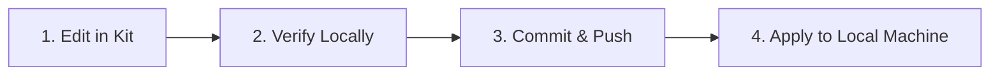

# Agent Harness Kit Guide

## Role & Scope
`agent-harness-kit` is the single versioned source of truth for company-wide AI agent standards, risk-based workflows, reusable skills, and modular project packs across Codex, Claude Code, Gemini, and Google Antigravity.

- **Company Core (`rules/core.md`)**: Shared mindset (7-Rung ladder), strict autonomy boundaries, risk-based workflow routing, and quality/shipping gates.
- **Modular Project Packs (`profiles/`)**: Project-specific rules and MCP declarations (e.g. Index platform).
- **Portable Skills (`skills/`)**: Modular, cross-agent capabilities installed into downstream harness environments.
- **Strict Anti-Drift Principle**: Machine-local configurations (`~/.claude/`, `~/.gemini/`, `~/.codex/`, `<workspace>/.agents/`) are downstream deployment targets. Never hand-edit local generated files or symlink destinations directly.

## Mandatory Harness Modification Lifecycle
Any modification to agent harness rules, skills, profiles, or hooks MUST strictly follow this 4-step lifecycle:



1. **Edit in Kit**:
   Perform all changes inside this repository (`agent-harness-kit`). NEVER hand-edit generated rule files or local symlink destinations directly in downstream projects or `~/.gemini/`, `~/.claude/`, etc.

2. **Verify Locally**:
   Run all verification and behavioral test suites before committing:
   ```bash
   ./scripts/verify.sh
   ./tests/test_harness.sh
   ./scripts/check-skill-ownership.sh <workspace-path>
   ```

3. **Commit & Push to Remote**:
   Create a conventional commit and push to the GitHub remote (`origin`):
   ```bash
   git add <modified-files>
   git commit -m "Docs: Establish Harness Change-Push-Apply Lifecycle Rule"
   git push -u origin <branch-name>
   ```
   Open a pull request via `gh pr create`.

4. **Apply to Local Machine**:
   Redeploy changes to propagate them back to local configurations:
   - **Global rules & skills**:
     ```bash
     ./scripts/install.sh --targets all --rules
     ```
   - **Project-specific packs (e.g., Index Platform)**:
     ```bash
     ./scripts/install.sh --index --project-path <workspace-path> --targets all --rules
     ```
     *(e.g., `--project-path ~/index`)*

## Key Verification Commands
- `./scripts/verify.sh`: Validates bash syntax, python compilation, skill metadata/frontmatter, manifest JSONs, and cross-machine portability (strictly prevents machine-specific absolute home paths).
- `./tests/test_harness.sh`: Runs behavioral test suites covering installation, idempotency, project pack injection, MCP provisioning, and rollback.
- `./scripts/check-skill-ownership.sh <workspace-path>`: Audits skill ownership between the kit and target workspace repositories to prevent duplicated definitions.
