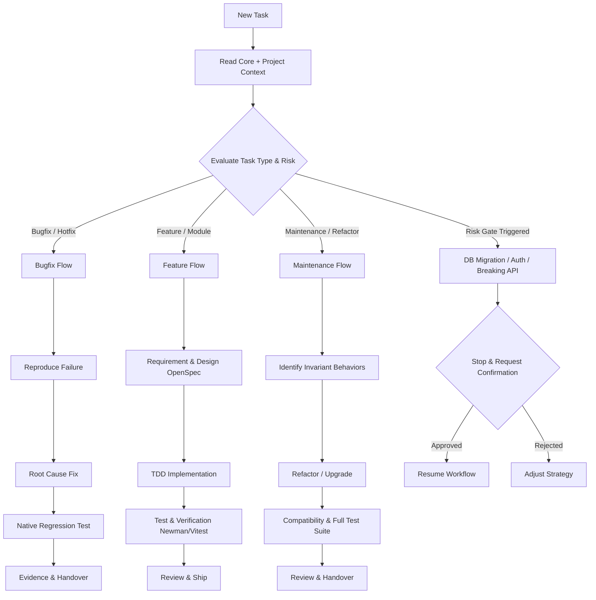

# Design Document: Tiered Harness & Modular Project Packs

## 1. Directory Structure

```text
agent-harness-kit/
├── .claude-plugin/
│   └── plugin.json          # Claude Code plugin manifest
├── .codex-plugin/
│   └── plugin.json          # Codex plugin manifest
├── plugin.json              # Antigravity root plugin manifest
├── profiles/
│   ├── core/
│   │   └── rules.md         # Core company defaults
│   └── index/
│       ├── workspace.md     # Index platform goals, tech stack overview, boundaries
│       ├── api.md           # Index API repo (NestJS, Prisma, Vitest, Newman)
│       └── cms.md           # Index CMS repo (Strapi v5, Jest, Content Types)
├── rules/
│   ├── core.md              # Global company-wide core rules
│   └── adapters/            # Harness adapters (claude.md, codex.md, gemini.md)
├── scripts/
│   ├── install.sh           # Main installer supporting --index, --project-path, --rollback
│   ├── sync_rules.py        # Rule merging and block updating
│   ├── rollback.py          # Receipt-based rollback executor
│   ├── verify.py            # Integrity and portability validator
│   └── update.sh            # Pull and reinstall
├── skills/                  # Portable reusable skills
├── tests/
│   └── install_test.sh      # Behavioral test suite
└── README.md
```

## 2. Core Company Rules & Autonomy Boundaries

### Principles
- **Data Protection**: Never execute destructive database actions (`prisma migrate reset`, dropping tables, truncate) without explicit user sign-off.
- **Scope Containment**: Touch only files relevant to the current task. No unrelated cosmetic refactors.
- **Git Hygiene**: Conventional commits, 1 commit per PR, no blanket `git add .`, push only during authorized `/ship` or after prompt.
- **Evidence Before Assertion**: All completions must include test output logs (`bun test`, `bun run lint`, etc.).

### Autonomy Matrix
- **Can Do Autonomously (`/build auto`)**:
  - Read, grep, explore codebase.
  - Create/switch to dedicated feature/bugfix branches.
  - Write test cases, implement fixes/features within scope.
  - Run linters, type checks, unit and integration tests.
  - Self-correct errors identified by compiler/test failures.
- **Must Ask User Before Proceeding**:
  - Database schema migrations or data alterations.
  - Removing or deprecating existing public API endpoints.
  - Adding new third-party dependencies.
  - Pushing branches to remote outside of `/ship`.
  - Architecture deviations from project pack.
- **Strictly Prohibited**:
  - Swallowing errors silently in empty `catch` blocks.
  - Bypassing type checking with `@ts-ignore` or `any` casts.
  - Storing secrets or tokens in code.
  - Committing unverified or broken code.

### Tiered Workflow Selection


## 3. Project Pack: Index Platform

### Structure
- **`workspace.md`**: Multi-repo architecture (Index platform: API, CMS, Web, AI, Data), platform-level conventions, authentication boundary, shared docker services.
- **`api.md`**: NestJS + Prisma service (`green_bull_api`), runtime `bun`, tests via `vitest run` and `bun postman/run-newman.ts`, lint via `eslint --fix`, strict DTO and BaseRepository enforcement. Unknown fields marked as `[TBD: Need User Input]`.
- **`cms.md`**: Strapi v5 service (`index-admin-cms`), Jest tests, custom permissions and scripts (`seed.js`, `dump-db.sh`). Unknown fields marked as `[TBD: Need User Input]`.

## 4. Installer & Rollback Specification

### CLI Usage
```bash
# Global Core installation
./scripts/install.sh --targets claude,codex,gemini [--mode symlink|copy]

# Project Pack injection (Index)
./scripts/install.sh --index --project-path /path/to/index --targets claude,codex

# Dry-run preview
./scripts/install.sh --index --project-path /path/to/index --dry-run

# Rollback
./scripts/install.sh --rollback latest
./scripts/install.sh --rollback <timestamp>
```

### `receipt.json` Schema
Stored in `${backup_root}/receipt.json`:
```json
{
  "timestamp": "2026-09-07T15:20:00Z",
  "command": "./scripts/install.sh ...",
  "actions": [
    {
      "type": "symlink",
      "target": "/path/to/.claude/skills/task",
      "source": "/path/to/agent-harness-kit/skills/task",
      "existed": false,
      "backup_path": null
    },
    {
      "type": "file_merge",
      "target": "/path/to/index/.claude/CLAUDE.md",
      "backup_path": "/path/to/.agent-harness-backups/20260907.../index_CLAUDE.md"
    }
  ]
}
```

During rollback:
- For `symlink` where `existed == false`: delete the symlink.
- For `symlink` with `backup_path`: restore the original from backup.
- For `file_merge` or `file_write` with `backup_path`: restore original file from backup; if it didn't exist before, remove created file.
