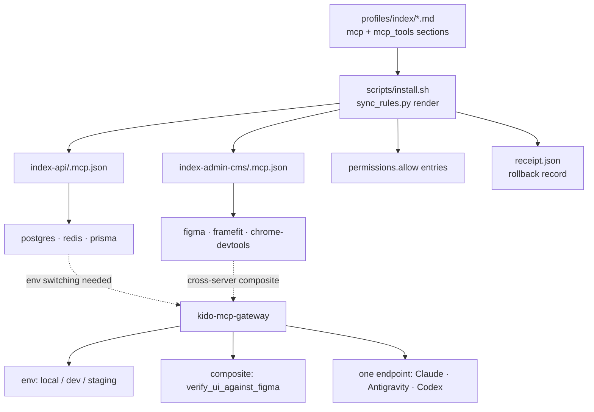

# Design

## Decision 1: native per-project config, gateway only where native falls short

Claude Code already scopes MCP per project through a project-root `.mcp.json` that is committed to the repo. Building an aggregator to achieve per-project scoping would reimplement a platform feature.

| Option | Pros | Cons | Performance & Complexity | Recommendation |
| --- | --- | --- | --- | --- |
| **A. Native per-project config only** | Zero runtime code; team-shared through git; no process in the path; upstream updates flow straight through | Static — an env switch means declaring `postgres-local`, `postgres-dev`, `postgres-staging` as three servers, tripling context; no composite tools; still one config shape per harness | No added latency; lowest complexity | ✅ **Layers 1-2** |
| **B. Gateway only** | One endpoint; env as a parameter; composite tools; one registration line per harness | Reimplements per-project scoping that already exists; every call gains a hop; a gateway outage takes every tool down | One extra process and hop; highest complexity | ❌ Not on its own |
| **C. Native first, gateway for the three gaps** | Native handles scoping for free; gateway earns its place only on env switching, composite tools, and cross-harness registration | Two mechanisms to understand | Hop only on gateway-routed calls | ✅ **Chosen** |

Layer 1 and 2 are native. Layer 3 is the gateway, and it is scoped to the three things native cannot do.

## Architecture



## Decision 2: allowlist, not blacklist

MCP tools default to on, so a deny list must name every tool an upstream server will ever add. The installer renders `mcp_tools` as `permissions.allow` entries and records which server each came from, so a server gaining tools does not silently gain context.

Verified against Claude Code docs: a `permissions.deny` pattern of `mcp__*` "removes every MCP tool across all servers **from context**" — filtering is a context operation, not only an execution gate. The equivalent mechanism on Antigravity and Codex is **unverified**; Phase 3 must confirm before claiming cross-harness parity.

## Profile contract

Profiles are Markdown. The MCP declaration is a fenced `toml` block so it parses without a new dependency:

````markdown
```toml
[mcp.postgres]
type = "http"
url = "http://localhost:33000/pg"

[mcp.framefit]
command = "npx"
args = ["-y", "framefit"]
env = { FIGMA_TOKEN = "${FIGMA_API_KEY}" }

mcp_tools = [
  "mcp__postgres__query",
  "mcp__framefit__get_layout_spec",
  "mcp__framefit__compare_node_to_dom",
]
```
````

Secrets are never literals — only `${VAR}` references, enforced by `verify.py`, which already rejects machine-specific paths.

## Renderer contract

```python
def render_mcp_config(profile: Profile, target: str) -> dict:
    """Return the harness-native MCP mapping for one target.

    target: "claude" | "codex" | "gemini"
    Claude  -> {"mcpServers": {...}} at <project>/.mcp.json
    """

def render_tool_allowlist(profile: Profile, target: str) -> list[str]:
    """Return permission entries, e.g. ["mcp__postgres__query", ...]."""
```

Both are pure functions over a parsed profile, so they are unit-testable without touching the filesystem — the installer owns all writes, and every write is appended to `receipt.json` for rollback.

## Gateway contract

```typescript
// Mounts upstream servers as child processes, re-exports a chosen subset.
interface GatewayConfig {
  mount: Record<string, StdioOrHttpServer>;   // upstream servers
  export: string[];                            // "framefit:get_layout_spec"
  env: Record<string, Record<string, string>>; // local | dev | staging
}
```

The gateway copies no upstream code. Servers are mounted as dependencies and proxied, so MIT obligations stay with the upstream packages and upstream updates arrive through `npx -y` without a merge.

## Risks

- **Gateway is a single point of failure.** Mitigation: Layers 1-2 stand alone; a gateway outage degrades to native per-project config rather than to nothing.
- **Cross-harness parity is assumed, not proven.** Mitigation: Phase 3 begins with a verification task and is allowed to land Claude-only if the others cannot match it.
- **Writing into project repos widens the installer's blast radius.** Mitigation: reuse the existing receipt/rollback path and project-isolation tests rather than adding a second write mechanism.

## Phase 3 verification findings

Gate question: do Antigravity and Codex support (a) per-tool MCP filtering and
(b) registering a single HTTP MCP endpoint? Evidence gathered from the shipped
binaries and their own CLIs on this machine, not from memory.

| Harness | (a) Per-tool filtering | (b) Single HTTP endpoint | Evidence |
| --- | --- | --- | --- |
| **Claude Code** | ✅ Confirmed | ✅ Confirmed | `permissions.allow` entries `mcp__server__tool` (Phase 2, already shipped); `claude mcp add --transport http sentry https://mcp.sentry.dev/mcp` in `claude mcp add --help` |
| **Codex** | ✅ Confirmed | ✅ Confirmed | `codex -c 'mcp_servers.strapi-docs.enabled_tools=["search_docs"]' mcp get strapi-docs` echoes back `enabled_tools: search_docs`, so the key is parsed, not ignored. `codex mcp add --url <URL>` documents "URL for a streamable HTTP MCP server"; `codex mcp get strapi-docs` reports `transport: streamable_http` |
| **Antigravity** | ❌ **Not confirmed** | ✅ Confirmed | `agy mcp add --type http` / "http/https URLs are detected automatically" in `agy mcp add --help`; the bundled `mcp_config.json` doc in the `agy` binary documents `serverUrl` (SSE) as a first-class transport |

### Why Antigravity's per-tool filtering is recorded as unconfirmed

`agy mcp` exposes `enable` and `disable` at **server** granularity only — there
is no per-tool flag. The `McpServerSpec` struct inside the `agy` binary does
carry `enabledTools` / `disabledTools` fields with `json` + `mapstructure` tags,
so `mcp_config.json` plausibly accepts them:

```
EnabledTools  json:"enabledTools,omitempty,omitzero"  mapstructure:"enabledTools,omitempty"
DisabledTools json:"disabledTools,omitempty,omitzero" mapstructure:"disabledTools,omitempty"
```

But the MCP documentation embedded in that same binary
(`# MCP Servers (mcp_config.json)`) documents only `command`, `args`, `env`, and
`serverUrl`, and states that "Discovered tools are **automatically** added to the
agent's toolset" with no filtering step. A struct field with no doc, no CLI
surface, and no observed runtime effect is not a confirmed capability. **This
change does not claim Antigravity per-tool filtering.**

### How this scopes Phase 3

- **Layer 2 (`mcp_tools` -> native permission allowlist) stays Claude-only.**
  `render_tool_allowlist` continues to return the `NotSupported` marker for
  `gemini`. Codex could be supported natively via `enabled_tools`, but wiring
  that is a separate change — it is recorded here so the next change does not
  have to re-derive it.
- **Layer 3 (the gateway) is harness-agnostic and is where Antigravity gets
  filtering at all.** Because every one of the three harnesses can register a
  single HTTP MCP endpoint, the gateway's `export` allowlist is enforced
  server-side, inside the gateway, where it works for every client regardless of
  that client's own filtering support. This is the strongest argument for the
  gateway found so far: it is not a convenience for Antigravity, it is the only
  confirmed mechanism.
- The gateway is therefore built once, registered three ways, and its README
  section documents the exact registration line per harness.
