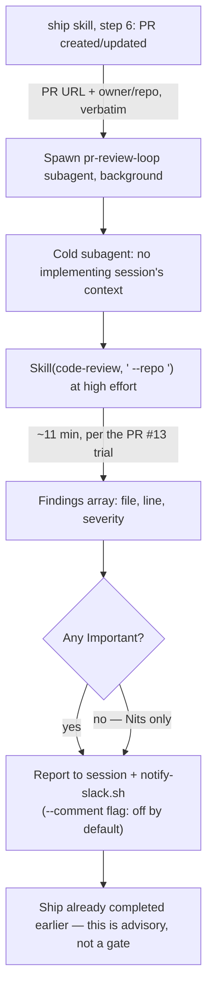

# Design

## Decision 1 — trigger mechanism: skill-step vs PostToolUse hook

| Option | Pros | Cons | Performance & Complexity | Recommendation |
|---|---|---|---|---|
| **A. `ship`'s final step spawns a subagent** | Matches the user's own framing ("post /ship skill"); scoped to only the `/ship` workflow, not every stray `gh pr create`; reuses the exact Agent-tool spawn pattern already used throughout this session; no changes to the hooks infrastructure just stabilized in PR #15 | Only fires when `/ship` is actually invoked — a manual `gh pr create` bypasses it | Low — one new skill, one new step in an existing skill | ✅ **Chosen** |
| **B. `PostToolUse` hook on `Bash` matching `gh pr create`, `type: agent`** | Fires on *any* PR creation, not just via `/ship`; Claude Code's `agent`-type hook exists for exactly this | Wires into the hooks infra fixed one PR ago — untested surface for `type: agent` specifically; matches on shell text (`gh pr create`), which is brittle against quoting/aliasing; broader blast radius than asked for (every repo, every trigger, forever, the instant it's deployed) | Medium — new hook type, new failure modes to test | ❌ Not this change |

Chosen A. The scope-gap section of `proposal.md` already names what B would additionally cover (nothing — B still only fires when a human invokes `gh pr create`, so it does not close the Antigravity-cron gap either); B is a strictly larger blast radius for the same coverage, not a superset of value.

## Decision 2 — auto-commenting default

| Option | Pros | Cons | Recommendation |
|---|---|---|---|
| **A. `--comment` on by default** | Matches the course's "logged in PR history, audit record" model exactly; zero extra step to see findings | Unattended comments on teammates' PRs, from the operator's own GitHub identity, on every future ship, forever, the moment this merges — a materially bigger authorization than anything else this kit has auto-enabled | ❌ |
| **B. `--comment` off by default, findings to session + Slack** | Matches the kit's own established reporting channel (`notify-slack.sh`, already used for the E2E gate); reversible in the direction that matters — turning ON auto-comments is a one-word change once trusted, turning them OFF after they've landed on someone else's PR is not | Findings live one hop away from the PR itself until someone reads Slack | ✅ **Chosen** |

## Flow



## Interface sketch

`pr-review-loop`'s contract, for `ship` to call against:

```
Inputs (required, passed explicitly — never re-derived):
  pr_url:  string   # e.g. https://github.com/khanhduong22/agent-harness-kit/pull/16
  repo:    string   # "owner/name", e.g. khanhduong22/agent-harness-kit

Inputs (optional):
  comment: boolean  # default false — see Decision 2

Behavior:
  1. Skill(code-review, "<pr_url> --repo <repo>")  — effort high, never ultra
  2. Partition findings by severity: Important (breaks behavior / leaks data /
     breaches policy) vs Nit (everything else) — the course's own cut line
  3. If comment=true: also invoke code-review's own --comment path
  4. Always: return a findings summary to the caller AND notify-slack.sh with
     the PR link + Important/Nit counts
```

## Why the severity gate matters here specifically

The hooks migration's `auto-lint-fix.sh` surfaced 67 pre-existing lint problems in `index-api` the first time it ran for real (documented in PR #13/#14's evidence). A reviewer with no severity gate would report all 67 as undifferentiated noise on every future PR touching that repo, training the operator to ignore the report entirely — the same failure mode `academy.claude.com`'s own Important/Nit split exists to prevent. `code-review`'s own output already carries severity; this change's only job is to read it and gate on it, not to reclassify anything itself.

## Non-goals

- Blocking merge on findings (the course's CI pattern; this is a local advisory step, not branch protection).
- Covering the Antigravity cron routine (named as an open gap in `proposal.md`).
- OpenTelemetry export of review verdicts (raised as a possible future `hooks-as-approval-gates` follow-up in conversation; not part of this change, not index-signoz's concern here).
