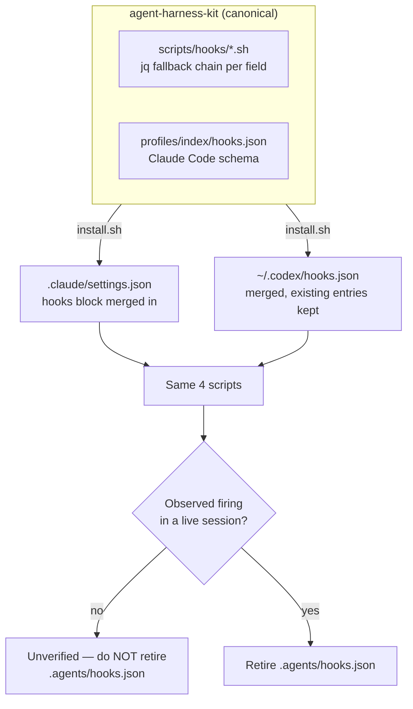

# Design

## Decision 1 — how the scripts read a payload they no longer recognise

Three agents send three different JSON shapes for the same facts. The scripts need the file path, the command line, and the workspace directory, whoever is asking.

| Option | Pros | Cons | Performance & Complexity | Recommendation |
|---|---|---|---|---|
| **A. One script per host** (`auto-lint-fix.claude.sh`, `.codex.sh`, …) | Each file is simple; no branching | 4 scripts × 3 hosts = 12 files, and a fix to the lint logic must land in 3 places. This is the duplication the kit's ownership boundary exists to prevent | Low per file, high to maintain | ❌ |
| **B. A shared adapter that normalises stdin, then execs the script** | Single place to learn a new host's shape | A new file in the call path, plus a second process per hook invocation, to move three strings | Extra indirection for very little | ❌ |
| **C. jq fallback chain inside each script** | One expression handles every host: `.tool_input.file_path // .toolCall.args.TargetFile // empty`. No new files, no extra process, adding a host is one more `//` term | The chain must be written correctly in each script (4 places, one line each) | Lowest — jq already runs in all four scripts | ✅ **Chosen** |

Option C is rung 6 of the ladder: the whole migration of a field is one line. `jq` is already a hard dependency of all four scripts, so nothing new is introduced.

Workspace directory has no equivalent field in the Claude Code or Codex payload. It falls back to the process working directory, which is what the scripts ultimately used the Antigravity value for.

## Decision 2 — one hook definition or one per host

`~/.codex/hooks.json` already uses the Claude Code schema exactly: the same event names, `matcher` carrying Claude Code tool names (`Grep|Glob|Bash`), and the same `{type, command, timeout, statusMessage}` entries. There is no second shape to write. One `hooks.json` in the profile is deployed to both hosts.

Antigravity keeps its own file because its schema genuinely differs — a named-hook wrapper with an `enabled` flag, and Antigravity's own tool names. That file is not the kit's to maintain and is retired, not ported.

## Flow

## Payload field mapping

The contract each script must satisfy, expressed as the jq expression it uses:

| Need | Expression |
|---|---|
| Edited file path | `.tool_input.file_path // .toolCall.args.TargetFile // empty` |
| Command line | `.tool_input.command // .toolCall.args.CommandLine // empty` |
| Workspace directory | `.cwd // .workspacePaths[0] // empty`, falling back to `$PWD` |

`stop-gate.sh` is the exception: `.terminationReason`, `.executionNum` and `.transcriptPath` have no counterpart in the Claude Code Stop payload. It must degrade to running its gate unconditionally rather than reading fields that will always be empty — a gate that silently skips because a field is missing is the failure mode this whole change exists to remove.

## Merge safety

`install.sh` already merges marker-delimited rule blocks and the MCP permission allowlist without clobbering operator entries, and `tests/test_harness.sh` Test 6 proves the allowlist case. Hook merging follows the same contract and gets the same kind of test: an operator-added hook on a different event must survive a reinstall, and a reinstall must not duplicate the kit's own entries.

## Risk

A `PreToolUse` hook on `Bash` can block commands. A bug there stops the operator working, so `guard-new-packages.sh` must fail open — any error inside it exits 0 and allows the command, rather than blocking on a parse failure.
