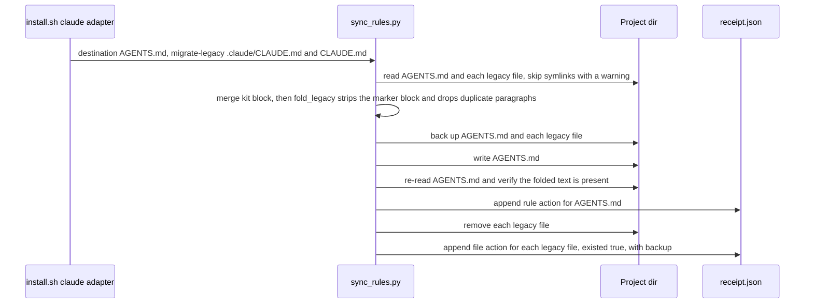

# Design: AGENTS.md As The Single Project Instruction File

## Verified behaviour this design rests on

Claude Code 2.1.278, headless `claude -p`, unique sentinel strings the model can only quote if they are in loaded context. Scratch dirs outside `$HOME` unless stated.

| # | Setup | Result |
|---|---|---|
| 1 | Project with `AGENTS.md` only | loaded; `~/.claude/CLAUDE.md` still loads alongside |
| 2 | Project with `AGENTS.md` and `CLAUDE.md` | `CLAUDE.md` only |
| 3 | Replica of migrated `~/index`: `AGENTS.md` with `@.agents/AGENTS.md` import and kit pack, no `CLAUDE.md` | root file, imported file and pack all load |
| 4 | `~/.claude/AGENTS.md`, launched outside `$HOME` | **not loaded** |
| 5 | `~/.claude/AGENTS.md`, launched inside `$HOME` | loaded, incidentally (ancestor walk reaches it as `.claude/AGENTS.md`) |
| 6 | Workspace `AGENTS.md` above, service `CLAUDE.md` below, launched in service | **service `CLAUDE.md` only; workspace `AGENTS.md` hidden** |
| 7 | Workspace `AGENTS.md` above, service `AGENTS.md` below | both load |
| 8 | Same as 6 with `instructionFiles=claude-md-and-agents-md` | both load |
| 9 | Workspace `CLAUDE.md` above, service `AGENTS.md` below (the state right after a service PR is pulled, before the workspace file is retired) | **workspace `CLAUDE.md` only; service `AGENTS.md` hidden** |

Docs (Claude Code memory page): `AGENTS.md` is read only when no `CLAUDE.md`, `.claude/CLAUDE.md` or `CLAUDE.local.md` exists in the working directory or above; anything under `.agents/` is never read; `~/.claude/CLAUDE.md` does not count as a `CLAUDE.md` for that check. Requires Claude Code ≥ 2.1.277.

## Options considered

| Option | Pros | Cons | Performance & Complexity | Recommendation |
|---|---|---|---|---|
| A. Rename everything, including `~/.claude/CLAUDE.md` | Literal; one filename everywhere | Global rules stop loading (rows 4–5). Any leftover project `CLAUDE.md` still hides `AGENTS.md` (row 2) | Trivial edit, high blast radius | Rejected |
| **B. Split by level: global stays `CLAUDE.md`; every project uses `AGENTS.md`; legacy project `CLAUDE.md` is migrated and removed** | One tracked file per project for all three tools. Global path untouched. Fully reversible | Needs migration logic; `CLAUDE.md` in an untouched repo (`index-ai`, `index-web`) keeps hiding the workspace `AGENTS.md` (row 6) | ~40 lines Python + 3 lines shell + tests | **Chosen** |
| C. Status quo | No risk | Two files to keep in step; already drifting | None | Rejected |

### Sub-decisions

| Question | Choice | Why |
|---|---|---|
| What to do with a legacy project `CLAUDE.md` | **Back up, fold non-kit text into `AGENTS.md`, then remove** | Leaving it hides `AGENTS.md` (row 2). Deleting outright loses operator-written text; the workspace profile says never strip rules without approval |
| Where the logic lives | **New `--migrate-legacy` option on `sync_rules.py`** | It already owns markers, backups and receipts. A separate script would duplicate all three |
| Rollback support | **Reuse existing receipt types** | `rollback.py` restores a `file` action from its backup even when the destination is gone, and replays in reverse, so no `rollback.py` change |
| Service-repo files (`index-api/CLAUDE.md`, …) | **Not the installer's job** | They live in other git repos with their own history. Tracked ones move via their own PRs. Untracked leftovers are a one-time local cleanup (Rollout) |
| Claude `instructionFiles=claude-md-and-agents-md` setting | **Rejected by the operator** | Would keep both files alive, which is the opposite of the goal. Stays documented as an escape hatch for `index-ai`/`index-web` |

## Migration flow



Failure safety: nothing is removed until `AGENTS.md` has been written **and re-read successfully**. Any error before that leaves every legacy file in place.

## Interface sketch

```python
def fold_legacy(agents_text: str, legacy_text: str, marker_prefix: str) -> str:
    """Return agents_text with legacy_text's non-kit paragraphs appended.

    Pure. Strips the <!-- marker:start/end --> block from legacy_text (the kit
    regenerates it), splits the remainder into blank-line-separated paragraphs,
    drops any whose whitespace-normalised text already occurs in agents_text,
    and appends the rest under a '## Migrated from <name>' heading outside the
    kit markers. Returns agents_text unchanged when nothing is left to fold.
    Raises ValueError on an incomplete marker block (caller leaves the file alone).
    """
```

CLI: `sync_rules.py … --destination <p>/AGENTS.md --migrate-legacy <p>/.claude/CLAUDE.md --migrate-legacy <p>/CLAUDE.md` (repeatable, `action="append"`).

Backup naming: `<backup_dir>/<label>/legacy/<path relative to destination.parent, "/" replaced by "__">`, so `.claude/CLAUDE.md` and `CLAUDE.md` never collide.

Receipt (existing shapes, existing rollback):
```json
[
  {"type": "rule", "destination": ".../AGENTS.md",   "existed": true, "backup_path": ".../claude-index/AGENTS.md"},
  {"type": "file", "destination": ".../CLAUDE.md",   "existed": true, "backup_path": ".../claude-index/legacy/CLAUDE.md"}
]
```
Reverse replay restores the legacy file first, then `AGENTS.md`.

## Rollout and sequencing (state verified 2026-09-21)

Service PRs: `index-signoz` #17 merged; `index-admin-cms` #673, `index-api` #464, `index-data` #621 open. Kit PR #20 (docs) open.

**No ordering of the two halves avoids a broken intermediate state.** Rows 6 and 9 are mirror images: retire the workspace `CLAUDE.md` first and every service that still has its own `CLAUDE.md` loses the workspace pack; convert the services first and the still-present workspace `CLAUDE.md` hides their `AGENTS.md`. The halves must land together, with no new Claude session started between them. Sessions already running are unaffected, because instructions load at session start.

**Apply gate.** The workspace migration is applied only when a check of the real machine predicts no regression: for each in-scope service dir (`index-signoz`, `index-admin-cms`, `index-api`, `index-data`), no `CLAUDE.md`, `.claude/CLAUDE.md` or `CLAUDE.local.md` exists in the dir or any ancestor other than the workspace `CLAUDE.md` being retired. `index-ai` and `index-web` are excluded from the gate by decision; they stay blocked (Risks).

**Gate result, 2026-09-21, before the first apply: all six service dirs blocked**, because each still holds its own local `CLAUDE.md`. The workspace step was therefore deferred. The global-rules step has no such dependency and was applied on its own (exactly 2 lines of `~/.claude/CLAUDE.md` change).

What must be true before the workspace step can pass the gate:

1. The three open service PRs are merged.
2. Each in-scope service checkout carries the `AGENTS.md`-only state. `index-signoz` (clean `develop`) fast-forwards. `index-admin-cms` and `index-api` sit on the operator's in-progress branches, which must first contain the merged change; the installer never edits a service repo's tracked files.
3. The untracked leftovers below are backed up and removed.

Then run the installer for `~/index`, and re-run the gate check afterwards.

One-time local cleanup, backed up to `~/.agent-harness-backups/manual-agents-md-<stamp>/` before removal, all untracked so git cannot restore them:

| File | Why it goes |
|---|---|
| `~/index/CLAUDE.md` | handled by the installer, not by hand |
| `~/index/index-api/CLAUDE.md` | hand-written adapter; `CLAUDE.md` upstream was deleted on 2026-08-26; hides the new tracked `AGENTS.md` |
| `~/index/index-api/AGENTS.md` | stale kit-injected block (2026-09-11); would block the pull of #464 |
| `~/index/index-admin-cms/AGENTS.md` | stale kit-injected block; would block the pull of #673 |
| `~/index/index-data/CLAUDE.md` | hand-written adapter; hides the new tracked `AGENTS.md` |

Untouched by design: `index-ai`, `index-web`, `index-data/firecrawl/CLAUDE.md` (vendored upstream, subdirectory files still load).

## Risks

- **Accepted regression.** `index-ai` and `index-web` keep their own `CLAUDE.md`, so once `~/index/CLAUDE.md` is retired, a session started *inside* those two repos no longer sees the workspace pack (row 6). That includes the workspace rule that `index-web` is read-only. The operator chose to leave both repos untouched. Escape hatch when wanted: the `instructionFiles` setting, or converting those repos.
- Claude Code < 2.1.277, and sessions that cannot fetch feature flags (telemetry disabled, Bedrock), do not read `AGENTS.md` at all. The operator does not use Bedrock; older teammates must update.
- One transient observed: a single headless run on a valid `AGENTS.md` returned no instructions on its first attempt and passed on two identical re-runs. Cause unknown.
- Folded text lands under a `## Migrated from CLAUDE.md` heading verbatim, including any `# ` heading it contained. Lossless over pretty; the operator can tidy it once.
