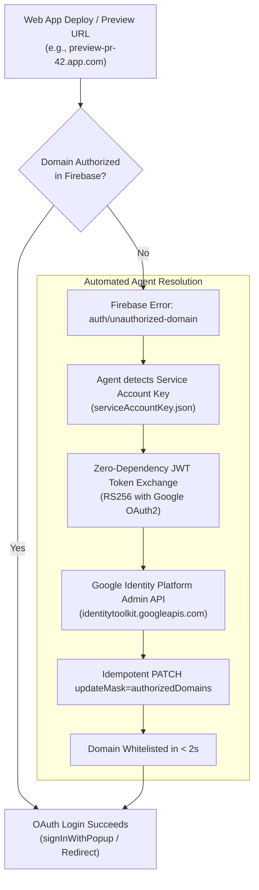

# Skill: Firebase Authorized Domains

## Purpose
Automate the inspection, addition, and maintenance of OAuth authorized domains for Firebase Authentication without requiring manual UI clicking in Firebase Console. 

Whenever frontend applications invoke Firebase OAuth sign-in (`signInWithPopup`, `signInWithRedirect`) on an unlisted domain, Google Identity Platform aborts authentication with `auth/unauthorized-domain`. This skill empowers AI agents and CI/CD pipelines to instantly whitelist new staging URLs, preview deployments, and custom production domains via Google Identity Platform REST API.

---

## Architecture & Automated Flow



---

## When to Activate This Skill

1. **OAuth Error Trigger**: Whenever runtime tests, user bug reports, or browser console logs report `auth/unauthorized-domain`.
2. **Preview & Staging Environments**: When deploying PR preview URLs (e.g. Vercel `*-projects.vercel.app`, Netlify, Cloudflare Pages) or setting up new staging environments (`*-staging.domain.com`).
3. **New Production Domains**: When launching on custom domains or apex/subdomain pairs (`example.com` + `www.example.com`).
4. **Pre-flight Deployment Checklist**: Verifying that all target environments are whitelisted before launching user traffic.

---

## Golden Rules & Domain Invariants

- **Pair Apex & WWW**: Always authorize both `example.com` and `www.example.com`. Authorizing only one leaves half your users stranded.
- **Preserve Localhost**: Never remove `localhost` from authorized domains during cleanups; local development depends on it.
- **Host Only, No Protocol or Ports**: Firebase authorized domains accept hostname only (e.g., `app.domain.com` or `localhost`). Strip `https://`, paths (`/auth`), and ports (`:3000`). The helper script sanitizes inputs automatically.
- **Service Account Security**: Never commit `serviceAccountKey.json` to public or shared git repositories. Ensure it is listed in `.gitignore`.

---

## The Portable Manager Script

This skill provides a self-contained, zero-dependency Node.js script located at:
`scripts/manage_domains.mjs` (or via installed skill at `~/.agents/skills/firebase-authorized-domains/scripts/manage_domains.mjs`).

### Prerequisites
- Node.js 18+ (uses native `node:crypto` and global `fetch`).
- A Firebase Service Account JSON file with `Firebase Authentication Admin`, `Editor`, or `Owner` role.
- Google Cloud `Identity Toolkit API` (`identitytoolkit.googleapis.com`) enabled.

---

## CLI Usage Guide

### 1. List Authorized Domains
```bash
node ~/.agents/skills/firebase-authorized-domains/scripts/manage_domains.mjs list \
  --key /path/to/serviceAccountKey.json
```

**JSON Output (for AI Agents & Automation):**
```bash
node ~/.agents/skills/firebase-authorized-domains/scripts/manage_domains.mjs list \
  --key /path/to/serviceAccountKey.json --json
```

### 2. Add New Domains (Idempotent)
Pass one or more domain names as positional arguments:
```bash
node ~/.agents/skills/firebase-authorized-domains/scripts/manage_domains.mjs add \
  example.com www.example.com preview-pr-42.app.vercel.app \
  --key /path/to/serviceAccountKey.json
```

> [!NOTE]
> The `add` command is completely idempotent. If a domain is already authorized, the script skips modifying it and reports no changes needed.

### 3. Remove Obsolete Domains
```bash
node ~/.agents/skills/firebase-authorized-domains/scripts/manage_domains.mjs remove \
  old-staging.example.com \
  --key /path/to/serviceAccountKey.json
```

---

## Environment Variable Convenience

To avoid repeating `--key /path/to/serviceAccountKey.json`, export:
```bash
export FIREBASE_SERVICE_ACCOUNT_KEY="/path/to/serviceAccountKey.json"
```
Or use the standard Google Cloud variable:
```bash
export GOOGLE_APPLICATION_CREDENTIALS="/path/to/serviceAccountKey.json"
```

Then execute directly:
```bash
node ~/.agents/skills/firebase-authorized-domains/scripts/manage_domains.mjs list
node ~/.agents/skills/firebase-authorized-domains/scripts/manage_domains.mjs add staging.app.com
```

---

## Troubleshooting & Verification

| Issue | Root Cause | Solution |
| :--- | :--- | :--- |
| `auth/unauthorized-domain` persists | Browser DNS/Firebase cache delay | Wait 10-30 seconds or test in private window; confirm domain matches hostname exactly |
| `403 Forbidden` / `Permission Denied` | Service Account lacks IAM role | Grant `Firebase Authentication Admin` role to service account in Google Cloud IAM |
| `404 Not Found` on config URL | Identity Toolkit API disabled | Enable `Identity Toolkit API` via Google Cloud Console: `gcloud services enable identitytoolkit.googleapis.com` |
| `Service account file not found` | Incorrect path passed to `--key` | Verify absolute or relative path to `serviceAccountKey.json` |

---

## Manual Fallback (When Service Account is Unavailable)

If no Service Account key exists or you lack backend credentials:
1. Open [Firebase Console](https://console.firebase.google.com).
2. Select target Firebase Project.
3. In left sidebar, navigate to **Build** -> **Authentication**.
4. Click on the **Settings** tab.
5. In the settings navigation, select **Authorized domains**.
6. Click **Add domain**, enter your domain name (e.g. `example.com`), and click **Save**.
7. Repeat for `www.example.com` or other subdomains.
