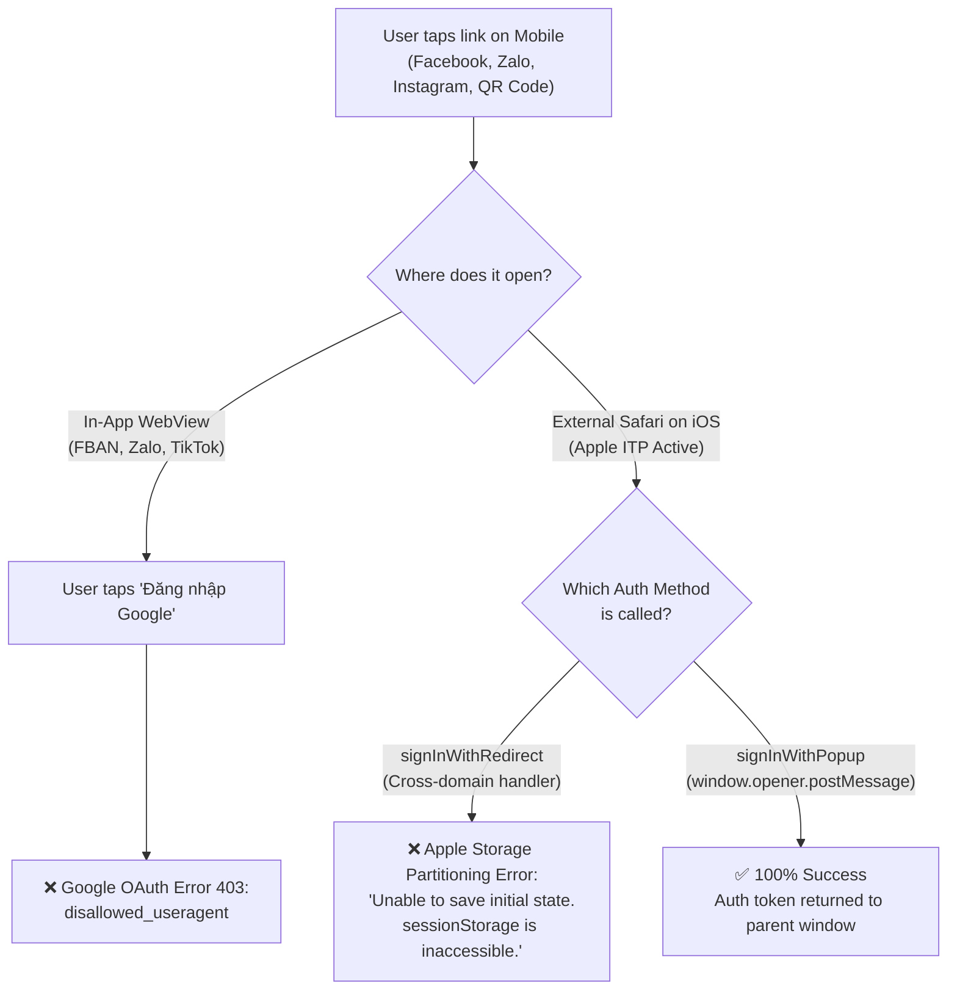

# Skill: Mobile In-App Browser & Web OAuth Architecture

## Purpose
Prevent web applications from getting trapped in mobile In-App WebViews (Facebook, Zalo, Instagram, TikTok, Messenger) and protect OAuth authentication (Google, Firebase Auth, Supabase) from Apple Safari ITP Storage Partitioning failures.

This skill equips AI agents with the architecture, detection logic, breakout mechanisms, and authentication invariants required to deliver rock-solid mobile web authentication.

---

## 1. The Two Fatal Mobile Web OAuth Pitfalls



### Pitfall 1: Google OAuth 403 `disallowed_useragent` in WebViews
* **The Mechanism**: Since 2021, Google blocks OAuth requests inside embedded WebViews (`WKWebView` on iOS, `Android WebView`) to prevent credential phishing and man-in-the-middle attacks.
* **Symptom**: When a user taps "Sign in with Google" inside Facebook, Zalo, or Instagram in-app browser, Google displays a blocked 403 error page (`Error: disallowed_useragent`).
* **Root Cause**: The User-Agent contains app signatures (`FBAN`, `FBAV`, `FB_IAB`, `Zalo`, `Instagram`, `musical_ly`, `; wv`).

### Pitfall 2: Apple Safari ITP & Storage Partitioning with `signInWithRedirect`
* **The Mechanism**: On iOS 17+ and iOS 18+, Apple's Intelligent Tracking Prevention (ITP) enforces **Storage Partitioning** per top-level domain.
* **Symptom**: When `signInWithRedirect` redirects from `app.com` -> `accounts.google.com` -> `project.firebaseapp.com/__/auth/handler`:
  > `Unable to save initial state. This may happen if browser sessionStorage is inaccessible.`
  > `Unable to process request due to missing initial state. ... 2) Using signInWithRedirect in a storage-partitioned browser environment.`
* **Root Cause**: The Firebase handler page lives on `*.firebaseapp.com`. Because of Storage Partitioning, Safari isolates `sessionStorage` and cookies for `firebaseapp.com`, preventing it from reading the initial OAuth state created under `app.com`.

---

## 2. Mandatory Authentication Invariants

### 🛡️ Invariant A: ALWAYS Use `signInWithPopup` by Default
* **Rule**: For mobile web browsers (Safari on iOS, Chrome on Android) and desktop, **ALWAYS** make `signInWithPopup` the primary authentication method.
* **Why**: `signInWithPopup` opens a popup/tab that communicates back to the parent window via `window.opener.postMessage()`. It **never navigates the parent window away** and is **100% immune to Storage Partitioning and cross-domain cookie restrictions**.
* **Do NOT force `signInWithRedirect` on mobile**: Believing that "mobile doesn't support popups" is a fatal misconception. Modern Mobile Safari and Chrome support popup tabs perfectly when triggered by a direct user tap (`onClick`).

### 🛡️ Invariant B: Handle `auth/popup-blocked` Without Fallback to Broken Redirects
If a user's browser blocks popups, do **not** blindly fall back to `signInWithRedirect` on iOS. Inform the user with a clean guidance banner:
```typescript
if (error?.code === 'auth/popup-blocked') {
  setErrorMessage(
    'Cửa sổ đăng nhập bị chặn bởi trình duyệt. Bạn vui lòng bấm lại nút Đăng nhập hoặc tắt "Chặn cửa sổ bật lên" trong Cài đặt Safari nhé.'
  );
  return;
}
```

---

## 3. Platform Breakout Playbook

When an application is opened inside an In-App WebView, you must handle Android and iOS distinctly.

### A. Android: Automated Chrome Intent Breakout
Android allows apps to break out of embedded WebViews directly into Google Chrome using an `intent://` URI scheme:
```typescript
export function getAndroidChromeIntent(customPath?: string): string {
  if (typeof window !== 'undefined') {
    const host = window.location.host;
    const path = customPath || (window.location.pathname + window.location.search);
    const cleanPath = path.startsWith('/') ? path : `/${path}`;
    return `intent://${host}${cleanPath}#Intent;scheme=https;package=com.android.chrome;end`;
  }
  return '';
}
```
* **Behavior**: Setting `window.location.href = intentUrl` immediately instructs Android OS to launch the standalone Google Chrome browser at the exact current URL.

### B. iOS: The Visual Guide Banner & Clean Link Copy
Apple iOS restricts `WKWebView` from programmatically forcing an external Safari launch without user interaction. Attempting `x-safari-https://` or `x-web-search://` is unreliable and often rejected.

**The Golden Pattern for iOS**:
1. **Top Visual Banner / Instruction Modal**: Render an unmissable banner pointing to the top-right corner `↗ [ ⋯ ]`.
2. **Clear 3-Step Copy**:
   - `Bước 1`: Bấm vào dấu **[ ⋯ ]** ở góc trên bên phải màn hình.
   - `Bước 2`: Chọn **"Mở bằng trình duyệt bên ngoài"** (Safari).
   - `Bước 3`: Đăng nhập Gmail để ghi danh.
3. **One-Click Clean Link Copy Button**:
   - Provide a button: `[ 📋 Sao chép link để mở Safari ]`.
   - **Crucial**: Automatically sanitize the copied URL by stripping `fbclid`, `zarsrc`, and tracking bloat so users paste a clean, reliable link.

---

## 4. Reusable Detection & Sanitization Utility

Place this reusable utility in `src/lib/inAppBrowser.ts`:

```typescript
export interface InAppBrowserInfo {
  isInApp: boolean;
  isIOS: boolean;
  isAndroid: boolean;
  appName: string;
}

export function detectInAppBrowser(customUA?: string): InAppBrowserInfo {
  if (typeof window === 'undefined' && !customUA) {
    return { isInApp: false, isIOS: false, isAndroid: false, appName: '' };
  }

  // Developer preview override via URL params
  if (typeof window !== 'undefined') {
    try {
      const urlParams = new URLSearchParams(window.location.search);
      const preview = urlParams.get('preview_iab') || urlParams.get('iab');
      if (preview === 'ios' || preview === 'fb_ios') {
        return { isInApp: true, isIOS: true, isAndroid: false, appName: 'Facebook' };
      }
      if (preview === 'android' || preview === 'fb_android') {
        return { isInApp: true, isIOS: false, isAndroid: true, appName: 'Facebook' };
      }
    } catch {}
  }

  const ua = customUA || (typeof navigator !== 'undefined' ? navigator.userAgent : '') || '';

  const isIOS =
    /iPhone|iPad|iPod/i.test(ua) ||
    (typeof navigator !== 'undefined' &&
      navigator.platform === 'MacIntel' &&
      (navigator.maxTouchPoints || 0) > 1);
  const isAndroid = /Android/i.test(ua);

  // Standalone PWA mode allows standard OAuth popups
  const isStandalone =
    typeof window !== 'undefined' &&
    ((window.navigator as unknown as { standalone?: boolean })?.standalone === true ||
      window.matchMedia('(display-mode: standalone)').matches);

  if (isStandalone) {
    return { isInApp: false, isIOS, isAndroid, appName: '' };
  }

  let appName = '';
  let isInApp = false;

  if (/FBAN|FBAV|FB_IAB|FB4A|FBIOS/i.test(ua)) {
    appName = 'Facebook';
    isInApp = true;
  } else if (/Instagram/i.test(ua)) {
    appName = 'Instagram';
    isInApp = true;
  } else if (/Zalo/i.test(ua)) {
    appName = 'Zalo';
    isInApp = true;
  } else if (/TikTok|musical_ly|BytedanceWebview/i.test(ua)) {
    appName = 'TikTok';
    isInApp = true;
  } else if (/Messenger/i.test(ua)) {
    appName = 'Messenger';
    isInApp = true;
  } else if (/Line\//i.test(ua)) {
    appName = 'Line';
    isInApp = true;
  } else if (/MicroMessenger/i.test(ua)) {
    appName = 'WeChat';
    isInApp = true;
  } else if (isIOS) {
    // Detect generic iOS WebViews
    const isKnownStandalone = /CriOS|FxiOS|EdgiOS|OPiOS/i.test(ua);
    if (!isKnownStandalone && /AppleWebKit/i.test(ua)) {
      const isMobileSafari = /Version\/.*Safari/i.test(ua);
      if (!isMobileSafari || /wv|WebView/i.test(ua)) {
        appName = 'ứng dụng';
        isInApp = true;
      }
    }
  } else if (isAndroid) {
    if (/;\s*wv|Version\/[0-9.]*\s*Chrome/i.test(ua)) {
      appName = 'ứng dụng';
      isInApp = true;
    }
  }

  return {
    isInApp,
    isIOS,
    isAndroid,
    appName: appName || 'ứng dụng',
  };
}

/**
 * Resilient clipboard copy with fallback for restricted WebViews
 */
export async function copyToClipboard(text: string): Promise<boolean> {
  if (typeof navigator !== 'undefined' && navigator.clipboard?.writeText) {
    try {
      await navigator.clipboard.writeText(text);
      return true;
    } catch {}
  }

  if (typeof document !== 'undefined') {
    try {
      const textArea = document.createElement('textarea');
      textArea.value = text;
      textArea.style.position = 'fixed';
      textArea.style.left = '-9999px';
      document.body.appendChild(textArea);
      textArea.focus();
      textArea.select();
      const success = document.execCommand('copy');
      document.body.removeChild(textArea);
      return success;
    } catch (err) {
      console.error('Fallback copy failed:', err);
      return false;
    }
  }
  return false;
}
```

---

## 5. URL Hygiene & Clean Address Bar

When users click links from Facebook or Zalo, tracking query parameters (`fbclid`, `zarsrc`) pollute the URL, distort Analytics, and get copied into friends' messages.

**Best Practice**: After capturing initial pageviews for Analytics, clean the address bar seamlessly via `window.history.replaceState`:
```typescript
if (typeof window !== 'undefined') {
  const url = new URL(window.location.href);
  if (url.searchParams.has('fbclid')) {
    url.searchParams.delete('fbclid');
    const newSearch = url.searchParams.toString() ? `?${url.searchParams.toString()}` : '';
    window.history.replaceState(null, '', `${url.pathname}${newSearch}${url.hash}`);
  }
}
```

---

## 6. Verification Checklist Before Shipping Mobile Auth

- [ ] `signInWithPopup` is configured as the default flow across mobile and desktop.
- [ ] No unconditional `signInWithRedirect` is called based on screen width or mobile user agent.
- [ ] In-App WebView is intercepted before triggering OAuth to prevent Google 403 `disallowed_useragent`.
- [ ] Android users in WebViews are provided an automated or 1-tap Chrome Intent button.
- [ ] iOS users in WebViews see an unmissable top indicator pointing to `↗ [ ⋯ ]` and a clean link copy button.
- [ ] Preview testing works via `?preview_iab=ios` and `?preview_iab=android`.
- [ ] Tested on actual iPhone Safari (not inside webview) to confirm Google OAuth popup completes and logs in without redirecting to `*.firebaseapp.com`.
