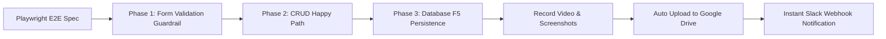

# Skill: Playwright E2E Testing & Cloud Video Verification

## Purpose
Automate high-confidence, full-lifecycle browser testing with Playwright, complete with video recording and cloud reporting. Ensures every feature is rigorously verified against runtime UI/DOM, validation guardrails, and persistent database state before human review.



## Testing Philosophy: 3-Layer Testing Pyramid

1. **Layer 1: Smoke & Navigation Test**:
   - Verify page loads, navigation links, and SideNav active item highlights.
2. **Layer 2: Full Lifecycle Functional CRUD (The Core Scenario)**:
   - **Phase 1: Form Validation Guardrails**: Submit empty form, assert inline error text/borders, verify ZERO network requests sent to backend.
   - **Phase 2: Create (Happy Path)**: Fill valid inputs, submit, assert modal closes and new item appears on UI.
   - **Phase 3: Update**: Open edit modal with prefilled data, edit fields, save, assert UI updates immediately.
   - **Phase 4: Delete**: Trigger removal, assert confirmation modal (`alertdialog`), confirm deletion, assert item disappears from UI.
   - **Phase 5: Persistence Verification**: Full page reload (`F5`), navigate back, assert database persisted correct state and deleted item is gone.
3. **Layer 3: RBAC (Role-Based Access Control) Matrix**:
   - Reuse Layer 2 core scenario with parametrized Playwright `storageState` files (`admin.json`, `moderator.json`, `viewer.json`).
   - Assert actions (Add, Edit, Delete) are disabled or hidden for unauthorized roles.

## Configuration Standard (`playwright.config.ts`)

Always configure Playwright with video recording and sufficient timeouts:

```typescript
import { defineConfig } from '@playwright/test';

export default defineConfig({
  testDir: './e2e',
  timeout: 60000, // 60s for full multi-step flows
  fullyParallel: false,
  retries: 0,
  use: {
    baseURL: process.env.CMS_BASE_URL || 'http://127.0.0.1:1337',
    video: {
      mode: 'on',
      size: { width: 1280, height: 720 },
    },
    screenshot: 'on',
    trace: 'retain-on-failure',
    viewport: { width: 1280, height: 720 },
  },
  outputDir: '/tmp/playwright-cms-results/',
});
```

## Best Practices & Lessons Learned

1. **Accessible Role Selectors**:
   - Prefer `page.getByRole('button', { name: '...' })` over loose text or CSS selectors.
   - For confirmation popups/dialogs, use `page.getByRole('alertdialog').getByRole('button', { name: '...' })`.
2. **Handle Dynamic Content & Modals**:
   - Scope buttons inside modals using `page.getByRole('dialog')` or `page.getByRole('alertdialog')` to prevent Playwright `strict mode violation` errors when multiple buttons share similar labels.
3. **Explicit Timeout**:
   - Always set `test.setTimeout(60000);` inside the test function when testing complete CRUD cycles.

## File Download & CSV Visual Verification Pattern (Headless Playwright)

Because headless browser execution only captures the browser viewport/DOM and cannot capture OS desktop applications (such as Microsoft Excel or Apple Numbers), tests verifying file exports MUST:
1. **Intercept download** via `page.waitForEvent('download')`.
2. **Verify file encoding**: Inspect the first 3 bytes to confirm UTF-8 BOM (`0xEF, 0xBB, 0xBF`) for Vietnamese characters compatibility in Microsoft Excel.
3. **Inject on-screen visual modal preview** via `page.evaluate(...)` rendering the parsed table with Vietnamese headers directly into the browser canvas.
4. **Pause for at least 3-4 seconds** (`await page.waitForTimeout(4000);`) so the video recording clearly captures the full table.

### Ready-to-Use CSV Download & Visual Modal Snippet

```typescript
// 1. Intercept download via page.waitForEvent('download')
const downloadPromise = page.waitForEvent('download');
await exportBtn.click();
const download = await downloadPromise;

// Verify suggested filename format
const suggestedFilename = download.suggestedFilename();
expect(suggestedFilename).toMatch(/^community-groups-\d{4}-\d{2}-\d{2}\.csv$/);

// 2. Read download content and verify UTF-8 BOM + Headers
const downloadPath = await download.path();
if (downloadPath) {
  const csvBuffer = fs.readFileSync(downloadPath);
  // Check first 3 bytes are UTF-8 BOM (0xEF, 0xBB, 0xBF)
  expect(csvBuffer[0]).toBe(0xEF);
  expect(csvBuffer[1]).toBe(0xBB);
  expect(csvBuffer[2]).toBe(0xBF);

  const csvText = csvBuffer.toString('utf-8');
  expect(csvText).toContain('Tên nhóm');
  expect(csvText).toContain('Quyền riêng tư');

  // Parse CSV into structured rows
  const lines = csvText.trim().split(/\r?\n/).filter(Boolean);
  const parsedRows = lines.map(line => {
    const result: string[] = [];
    let cur = '';
    let inQuotes = false;
    for (let i = 0; i < line.length; i++) {
      const char = line[i];
      if (char === '"') {
        inQuotes = !inQuotes;
      } else if (char === ',' && !inQuotes) {
        result.push(cur.trim());
        cur = '';
      } else {
        cur += char;
      }
    }
    result.push(cur.trim());
    return result.map(c => c.replace(/^"|"$/g, ''));
  });

  const headers = parsedRows[0] || [];
  const dataRows = parsedRows.slice(1, 8); // Display up to 7 rows

  // 3. Inject Visual Modal Preview of Downloaded CSV File for Video Clarity
  await page.evaluate(
    ({ headers, dataRows, totalRows, filename }) => {
      const overlay = document.createElement('div');
      overlay.id = 'csv-preview-overlay';
      overlay.style.cssText = `
        position: fixed;
        top: 0; left: 0; right: 0; bottom: 0;
        background: rgba(15, 23, 42, 0.75);
        backdrop-filter: blur(8px);
        z-index: 999999;
        display: flex;
        align-items: center;
        justify-content: center;
        font-family: -apple-system, BlinkMacSystemFont, 'Segoe UI', Roboto, Helvetica, Arial, sans-serif;
      `;

      overlay.innerHTML = `
        <div style="
          background: #ffffff;
          width: 92%;
          max-width: 1100px;
          max-height: 88vh;
          border-radius: 16px;
          box-shadow: 0 25px 50px -12px rgba(0, 0, 0, 0.35);
          overflow: hidden;
          display: flex;
          flex-direction: column;
          border: 1px solid #E2E8F0;
        ">
          <!-- Header -->
          <div style="
            background: linear-gradient(135deg, #4F46E5 0%, #2563EB 100%);
            padding: 20px 28px;
            color: white;
            display: flex;
            align-items: center;
            justify-content: space-between;
          ">
            <div style="display: flex; align-items: center; gap: 14px;">
              <div style="background: rgba(255,255,255,0.2); border-radius: 10px; padding: 10px 12px; font-size: 24px; line-height: 1;">
                📄
              </div>
              <div>
                <h2 style="margin: 0; font-size: 19px; font-weight: 700; letter-spacing: -0.01em;">
                  XÁC NHẬN NỘI DUNG FILE CSV (UTF-8 BOM VERIFIED)
                </h2>
                <p style="margin: 5px 0 0 0; font-size: 13px; opacity: 0.95; font-weight: 500;">
                  File đã tải: <strong>\${filename}</strong> • Chuẩn mã hóa: <strong>UTF-8 with BOM</strong> (Tương thích 100% Microsoft Excel & Numbers)
                </p>
              </div>
            </div>
            <div style="
              background: #10B981;
              color: white;
              padding: 6px 14px;
              border-radius: 20px;
              font-size: 12px;
              font-weight: 700;
              text-transform: uppercase;
              letter-spacing: 0.05em;
              box-shadow: 0 2px 4px rgba(0,0,0,0.15);
            ">
              ✓ UTF-8 BOM VALID
            </div>
          </div>

          <!-- Table Body -->
          <div style="padding: 20px 24px; overflow: auto; flex: 1; background: #F8FAFC;">
            <table style="width: 100%; border-collapse: collapse; background: white; border-radius: 8px; overflow: hidden; box-shadow: 0 1px 3px rgba(0,0,0,0.06); border: 1px solid #E2E8F0;">
              <thead>
                <tr style="background: #F1F5F9; border-bottom: 2px solid #CBD5E1;">
                  \${headers.map(h => \`<th style="padding: 12px 14px; text-align: left; font-size: 12px; font-weight: 700; color: #475569; text-transform: uppercase; letter-spacing: 0.03em; white-space: nowrap;">\${h}</th>\`).join('')}
                </tr>
              </thead>
              <tbody>
                \${dataRows.map((row, idx) => \`
                  <tr style="border-bottom: 1px solid #E2E8F0; background: \${idx % 2 === 0 ? '#FFFFFF' : '#F8FAFC'};">
                    \${row.map(cell => \`<td style="padding: 12px 14px; font-size: 13px; color: #1E293B; font-weight: 500; white-space: nowrap;">\${cell}</td>\`).join('')}
                  </tr>
                \`).join('')}
              </tbody>
            </table>
          </div>

          <!-- Footer -->
          <div style="
            padding: 14px 28px;
            background: white;
            border-top: 1px solid #E2E8F0;
            display: flex;
            align-items: center;
            justify-content: space-between;
            font-size: 13px;
            color: #64748B;
          ">
            <span>Đang hiển thị <strong>\${dataRows.length}</strong> / <strong>\${totalRows}</strong> bản ghi từ file CSV tải về</span>
            <span style="font-weight: 600; color: #4F46E5;">Trạng thái: Hoàn tất xuất dữ liệu CSV thành công 🚀</span>
          </div>
        </div>
      `;
      document.body.appendChild(overlay);
    },
    {
      headers,
      dataRows,
      totalRows: parsedRows.length - 1,
      filename: suggestedFilename,
    },
  );

  // 4. Pause for at least 3-4 seconds so the recording captures the full table
  await page.waitForTimeout(4000);
}
```

## Automated Cloud Reporting Workflow

### 1. Upload Video to Google Drive
```bash
./scripts/upload-e2e-video.sh <path-to-video.webm> "<Task-Name>"
```
- Uploads the video file to Google Drive using `rclone` (`gdrive:Index-E2E-Reports/YYYY-MM-DD/`).
- Automatically generates a public shareable Google Drive link (`https://drive.google.com/open?id=...`).

### 2. Dispatch Slack Notification
```bash
./scripts/notify-slack.sh \
  "<Task Name>" \
  "<GitHub PR URL>" \
  "<Status Details (Tests passed, typecheck clean)>" \
  "<Google Drive Video URL>" \
  "<Issue Info (e.g. #3151: Title)>" \
  "<Flow Steps (Multi-line breakdown of what to watch in video)>"
```

## Verification Checklist Before Handover
- [ ] Playwright test suite passes 100% (`1 passed`).
- [ ] For file/data exports: UTF-8 BOM encoding verified and on-screen preview modal rendered for >= 4s.
- [ ] Video recording generated in output directory.
- [ ] Video uploaded to Google Drive with active share link.
- [ ] Slack webhook notified with issue info, direct PR link, and flow steps.
