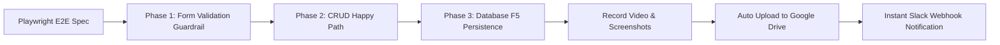

# Skill: Playwright E2E Testing & Cloud Video Verification

## Purpose
Automate high-confidence, full-lifecycle browser testing with Playwright, complete with video recording and cloud reporting. Ensures every feature is rigorously verified against runtime UI/DOM, validation guardrails, and persistent database state before human review.



## Testing Philosophy: 3-Layer Testing Pyramid

1. **Layer 1: Smoke & Navigation Test**:
   - Verify page loads, navigation links, and SideNav active item highlights.
2. **Layer 2: Full Lifecycle Functional CRUD (The Core Scenario)**:
   - **Phase 1: Form Validation Guardrails**: Submit empty form, assert inline error text/borders, verify ZERO network requests sent to backend.
   - **Phase 2: Create (Happy Path)**: Fill valid inputs, submit, assert modal closes and new item appears on UI.
   - **Phase 3: Update**: Open edit modal with prefilled data, edit fields, save, assert UI updates immediately.
   - **Phase 4: Delete**: Trigger removal, assert confirmation modal (`alertdialog`), confirm deletion, assert item disappears from UI.
   - **Phase 5: Persistence Verification**: Full page reload (`F5`), navigate back, assert database persisted correct state and deleted item is gone.
3. **Layer 3: RBAC (Role-Based Access Control) Matrix**:
   - Reuse Layer 2 core scenario with parametrized Playwright `storageState` files (`admin.json`, `moderator.json`, `viewer.json`).
   - Assert actions (Add, Edit, Delete) are disabled or hidden for unauthorized roles.

## Configuration Standard (`playwright.config.ts`)

Always configure Playwright with video recording and sufficient timeouts:

```typescript
import { defineConfig } from '@playwright/test';

export default defineConfig({
  testDir: './e2e',
  timeout: 60000, // 60s for full multi-step flows
  fullyParallel: false,
  retries: 0,
  use: {
    baseURL: process.env.CMS_BASE_URL || 'http://127.0.0.1:1337',
    video: {
      mode: 'on',
      size: { width: 1280, height: 720 },
    },
    screenshot: 'on',
    trace: 'retain-on-failure',
    viewport: { width: 1280, height: 720 },
  },
  outputDir: '/tmp/playwright-cms-results/',
});
```

## Best Practices & Lessons Learned

1. **Accessible Role Selectors**:
   - Prefer `page.getByRole('button', { name: '...' })` over loose text or CSS selectors.
   - For confirmation popups/dialogs, use `page.getByRole('alertdialog').getByRole('button', { name: '...' })`.
2. **Handle Dynamic Content & Modals**:
   - Scope buttons inside modals using `page.getByRole('dialog')` or `page.getByRole('alertdialog')` to prevent Playwright `strict mode violation` errors when multiple buttons share similar labels.
3. **Explicit Timeout**:
   - Always set `test.setTimeout(60000);` inside the test function when testing complete CRUD cycles.

## Automated Cloud Reporting Workflow

### 1. Upload Video to Google Drive
```bash
./scripts/upload-e2e-video.sh <path-to-video.webm> "<Task-Name>"
```
- Uploads the video file to Google Drive using `rclone` (`gdrive:Index-E2E-Reports/YYYY-MM-DD/`).
- Automatically generates a public shareable Google Drive link (`https://drive.google.com/open?id=...`).

### 2. Dispatch Slack Notification
```bash
./scripts/notify-slack.sh \
  "<Task Name>" \
  "<GitHub PR URL>" \
  "<Status Details (Tests passed, typecheck clean)>" \
  "<Google Drive Video URL>" \
  "<Issue Info (e.g. #3151: Title)>" \
  "<Flow Steps (Multi-line breakdown of what to watch in video)>"
```

## Verification Checklist Before Handover
- [ ] Playwright test suite passes 100% (`1 passed`).
- [ ] Video recording generated in output directory.
- [ ] Video uploaded to Google Drive with active share link.
- [ ] Slack webhook notified with issue info, direct PR link, and flow steps.
