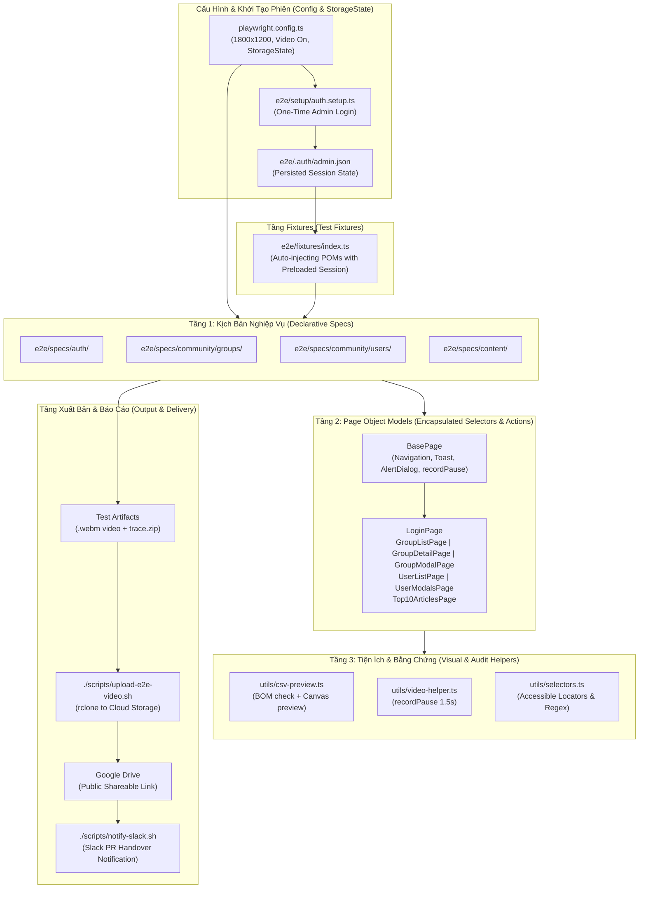

# Skill: Playwright E2E Testing & Modular Page Object Model (POM) Architecture

## Purpose
Automate high-confidence, full-lifecycle browser testing with Playwright, complete with video recording and cloud reporting. Ensures every administrative and client feature is rigorously verified against runtime UI/DOM, validation guardrails, and persistent database state before human review.

Adheres strictly to the **Modular Page Object Model (POM)** pattern, multi-project authentication caching, custom test fixtures, domain-driven spec hierarchy, and visual proof generation.

---

## 1. Architectural Diagram (Mermaid)



---

## 2. Enterprise Folder Structure

Playwright test suites must follow this modular, domain-driven hierarchy:

```text
e2e/
├── .auth/                          # [Gitignored] Session state (admin.json)
├── setup/                          # Global setup (auth.setup.ts)
├── fixtures/                       # Custom fixtures (index.ts, mock-api.ts)
├── pages/                          # POMs (base.page.ts, auth/, community/, content/)
├── specs/                          # Domain-driven specs (auth/, community/, content/)
└── utils/                          # Video pause, CSV preview, selectors
```

### Detailed Monorepo Directory Breakdown

```text
e2e/
├── .auth/                                  # Cached browser contexts (MUST be in .gitignore)
│   └── admin.json                          # Saved cookies, localStorage & session tokens
├── setup/                                  # Global one-time preparation projects
│   └── auth.setup.ts                       # Login once and generate storageState
├── fixtures/                               # Custom test runner extensions
│   ├── index.ts                            # test.extend injecting typed Page Objects
│   └── mock-api.ts                         # Network request mock & intercept helpers
├── pages/                                  # Modular Page Object Models (Encapsulated UI)
│   ├── base.page.ts                        # Abstract base (toasts, alerts, pauses, goto)
│   ├── auth/
│   │   └── login.page.ts                   # Login form fields and submit actions
│   ├── community/
│   │   ├── groups/
│   │   │   ├── group-list.page.ts          # Group table, filters, search, export button
│   │   │   ├── group-detail.page.ts        # Member list, roles, join requests
│   │   │   └── group-modal.page.ts         # Create/Edit modal inputs & inline errors
│   │   └── users/
│   │       ├── user-list.page.ts           # Community users table & moderation filters
│   │       └── user-modals.page.ts         # Ban, mute, and role assignment dialogs
│   └── content/
│       └── top-10-articles.page.ts         # Top 10 articles reorder, preview & publish
├── specs/                                  # Declarative domain test specifications
│   ├── auth/
│   │   └── admin-login.spec.ts             # Unauthenticated login tests & validation
│   ├── community/
│   │   ├── groups/
│   │   │   ├── group-crud.spec.ts          # 5-phase CRUD & persistence lifecycle
│   │   │   ├── group-analytics-export.spec.ts # CSV export & UTF-8 BOM verification
│   │   │   └── group-member-roles.spec.ts  # Member role transitions & permissions
│   │   └── users/
│   │       └── user-moderation.spec.ts     # User moderation, ban & role matrix
│   └── content/
│       └── top-10-articles.spec.ts         # Top 10 article curation flow
└── utils/                                  # Visual proof & audit helpers
    ├── csv-preview.ts                      # UTF-8 BOM check & in-browser canvas modal preview
    ├── video-helper.ts                     # recordPause for legible video recording
    └── selectors.ts                        # Accessible locator helpers and common regex
```

---

## 3. Testing Philosophy: 3-Layer Testing Pyramid

1. **Layer 1: Smoke & Navigation Test**:
   - Verify page loads, navigation links, and SideNav active item highlights.
2. **Layer 2: Full Lifecycle Functional CRUD (The Core Scenario)**:
   - **Phase 1: Form Validation Guardrails**: Submit empty form, assert inline error text/borders, verify ZERO network requests sent to backend.
   - **Phase 2: Create (Happy Path)**: Fill valid inputs, submit, assert modal closes, toast appears, and new item displays on UI.
   - **Phase 3: Update**: Open edit modal with prefilled data, edit fields, save, assert UI updates immediately.
   - **Phase 4: Delete**: Trigger removal, assert confirmation modal (`alertdialog`), confirm deletion, assert item disappears from UI.
   - **Phase 5: Persistence Verification**: Full page reload (`F5`), navigate back, assert database persisted correct state and deleted item is gone.
3. **Layer 3: RBAC (Role-Based Access Control) Matrix**:
   - Reuse Layer 2 core scenario with parametrized Playwright `storageState` files (`admin.json`, `moderator.json`, `viewer.json`).
   - Assert actions (Add, Edit, Delete) are disabled or hidden for unauthorized roles.

---

## 4. Code Implementation Patterns & Boilerplates

### 4.1. Playwright Multi-Project Configuration (`playwright.config.ts`)

Configures dependency chaining (`setup` -> `e2e-authenticated`), mandatory 1800x1200 viewport (MacBook M4 high-DPI ratio), and always-on video recording:

```typescript
import { defineConfig, devices } from '@playwright/test';
import path from 'node:path';

const STORAGE_STATE_PATH = path.resolve(__dirname, 'e2e/.auth/admin.json');

export default defineConfig({
  testDir: './e2e/specs',
  timeout: 60000, // 60s timeout for complete multi-phase CRUD scenarios
  fullyParallel: false, // Serial execution to prevent state collisions in shared DB
  retries: 0,
  workers: 1, // Single worker keeps database mutations deterministic
  outputDir: '/tmp/playwright-cms-results/',
  use: {
    baseURL: process.env.CMS_BASE_URL || 'http://127.0.0.1:1337',
    viewport: { width: 1800, height: 1200 },
    video: {
      mode: 'on',
      size: { width: 1800, height: 1200 },
    },
    screenshot: 'on',
    trace: 'retain-on-failure',
  },
  projects: [
    // 1. One-time Setup: Authenticates and saves storage state
    {
      name: 'setup',
      testDir: './e2e/setup',
      testMatch: /.*\.setup\.ts/,
    },
    // 2. Unauthenticated Specs (e.g. Login failures, public routes)
    {
      name: 'auth-specs',
      testDir: './e2e/specs/auth',
      use: {
        ...devices['Desktop Chrome'],
        viewport: { width: 1800, height: 1200 },
      },
    },
    // 3. Authenticated Business Flows: Reuses session saved by setup
    {
      name: 'e2e-authenticated',
      testDir: './e2e/specs',
      testIgnore: ['**/specs/auth/**'],
      dependencies: ['setup'],
      use: {
        ...devices['Desktop Chrome'],
        storageState: STORAGE_STATE_PATH,
        viewport: { width: 1800, height: 1200 },
      },
    },
  ],
});
```

---

### 4.2. One-Time Global Authentication Setup (`e2e/setup/auth.setup.ts`)

Performs a single administrative login and dumps browser cookies and localStorage into `admin.json`:

```typescript
import { test as setup, expect } from '@playwright/test';
import path from 'node:path';
import fs from 'node:fs';

const authDir = path.resolve(__dirname, '../.auth');
const authFile = path.join(authDir, 'admin.json');

setup('authenticate as admin', async ({ page }) => {
  if (!fs.existsSync(authDir)) {
    fs.mkdirSync(authDir, { recursive: true });
  }

  const email = process.env.CMS_ADMIN_EMAIL || 'admin@index.vn';
  const password = process.env.CMS_ADMIN_PASSWORD || 'Admin@123456';

  await page.goto('/admin');

  // Skip if already in an active session
  if (page.url().includes('/admin/content-manager') || page.url().includes('/admin/plugins')) {
    await page.context().storageState({ path: authFile });
    return;
  }

  // Fill credentials using accessible role selectors
  await page.getByRole('textbox', { name: /email/i }).fill(email);
  await page.getByRole('textbox', { name: /password|mật khẩu/i }).fill(password);
  await page.getByRole('button', { name: /đăng nhập|login|sign in/i }).click();

  // Wait for redirect to administrative interface
  await page.waitForURL(url => !url.pathname.includes('/auth/login') && url.pathname.includes('/admin'), {
    timeout: 15000,
  });

  // Verify dashboard navigation bar is visible
  await expect(page.locator('nav, aside, header').first()).toBeVisible({ timeout: 10000 });

  // Persist session state
  await page.context().storageState({ path: authFile });
});
```

---

### 4.3. Custom Test Fixtures (`e2e/fixtures/index.ts`)

Injects pre-instantiated, typed Page Object Models into specs so individual tests never deal with `new PageObject(page)` boilerplate:

```typescript
import { test as base, expect } from '@playwright/test';
import { LoginPage } from '../pages/auth/login.page';
import { GroupListPage } from '../pages/community/groups/group-list.page';
import { GroupDetailPage } from '../pages/community/groups/group-detail.page';
import { GroupModalPage } from '../pages/community/groups/group-modal.page';
import { UserListPage } from '../pages/community/users/user-list.page';
import { UserModalsPage } from '../pages/community/users/user-modals.page';
import { Top10ArticlesPage } from '../pages/content/top-10-articles.page';

export interface CustomFixtures {
  loginPage: LoginPage;
  groupListPage: GroupListPage;
  groupDetailPage: GroupDetailPage;
  groupModalPage: GroupModalPage;
  userListPage: UserListPage;
  userModalsPage: UserModalsPage;
  top10ArticlesPage: Top10ArticlesPage;
}

export const test = base.extend<CustomFixtures>({
  loginPage: async ({ page }, use) => {
    await use(new LoginPage(page));
  },
  groupListPage: async ({ page }, use) => {
    await use(new GroupListPage(page));
  },
  groupDetailPage: async ({ page }, use) => {
    await use(new GroupDetailPage(page));
  },
  groupModalPage: async ({ page }, use) => {
    await use(new GroupModalPage(page));
  },
  userListPage: async ({ page }, use) => {
    await use(new UserListPage(page));
  },
  userModalsPage: async ({ page }, use) => {
    await use(new UserModalsPage(page));
  },
  top10ArticlesPage: async ({ page }, use) => {
    await use(new Top10ArticlesPage(page));
  },
});

export { expect };
```

---

### 4.4. Base Page Object Model (`e2e/pages/base.page.ts`)

Encapsulates common navigation, notification verification, alertdialog handling, and recording pauses:

```typescript
import { Page, Locator, expect } from '@playwright/test';
import { recordPause } from '../utils/video-helper';

export abstract class BasePage {
  constructor(protected readonly page: Page) {}

  /**
   * Navigate to target path and wait for network/DOM stabilization
   */
  async goto(path: string): Promise<void> {
    await this.page.goto(path, { waitUntil: 'domcontentloaded' });
    await this.waitForPageLoaded();
    await this.recordPause(1000);
  }

  /**
   * Deliberate pause between critical user actions for clear video proof
   */
  async recordPause(ms: number = 1500): Promise<void> {
    await recordPause(this.page, ms);
  }

  /**
   * Assert notification toast presence and message
   */
  async expectToast(message: string | RegExp): Promise<void> {
    const toast = this.page
      .locator('[data-testid="toast"], [role="status"], .chakra-toast, .strapi-toast')
      .filter({ hasText: message });
    await expect(toast.first()).toBeVisible({ timeout: 5000 });
    await this.recordPause(1200);
  }

  /**
   * Confirm an alertdialog (e.g. Delete or Ban confirmation)
   */
  async confirmAlertDialog(confirmButtonName: RegExp = /xác nhận|đồng ý|xóa|confirm|delete/i): Promise<void> {
    const dialog = this.page.getByRole('alertdialog');
    await expect(dialog).toBeVisible({ timeout: 5000 });
    await this.recordPause(800);
    await dialog.getByRole('button', { name: confirmButtonName }).click();
    await expect(dialog).toBeHidden({ timeout: 5000 });
    await this.recordPause(1000);
  }

  /**
   * Cancel an alertdialog
   */
  async cancelAlertDialog(cancelButtonName: RegExp = /hủy|đóng|cancel|close/i): Promise<void> {
    const dialog = this.page.getByRole('alertdialog');
    await dialog.getByRole('button', { name: cancelButtonName }).click();
    await expect(dialog).toBeHidden({ timeout: 5000 });
  }

  /**
   * Wait for network idle and dismissal of loading spinners
   */
  async waitForPageLoaded(): Promise<void> {
    await this.page.waitForLoadState('networkidle').catch(() => {});
    const spinner = this.page.locator('[role="progressbar"], .loading-spinner, [data-testid="loader"]');
    if (await spinner.count() > 0) {
      await spinner.first().waitFor({ state: 'hidden', timeout: 8000 }).catch(() => {});
    }
  }
}
```

---

### 4.5. Video Helper (`e2e/utils/video-helper.ts`)

Controls playback pacing during test execution. Headless Chromium performs actions in 10-50ms; without controlled pauses, video recordings are too fast for human review.

```typescript
import { Page } from '@playwright/test';

/**
 * Deliberate pause between critical user actions during video recording.
 * Headless automation moves faster than the human eye. Pacing key state transitions
 * ensures video evidence is clear, readable, and actionable for stakeholders.
 */
export async function recordPause(page: Page, ms: number = 1500): Promise<void> {
  await page.waitForTimeout(ms);
}
```

---

### 4.6. CSV Preview & UTF-8 BOM Validator (`e2e/utils/csv-preview.ts`)

Because headless browser testing cannot record native desktop apps (Excel or Numbers), tests verifying data exports must validate UTF-8 BOM encoding and inject an on-screen preview modal:

```typescript
import { Page, Download, expect } from '@playwright/test';
import fs from 'node:fs';

export interface CsvPreviewOptions {
  expectedFilenameRegex?: RegExp;
  expectedHeaders?: string[];
  maxPreviewRows?: number;
  pauseMs?: number;
}

/**
 * Validates downloaded CSV encoding (UTF-8 BOM), parses headers/rows,
 * and renders an in-browser high-contrast canvas modal overlay for video recording audit.
 */
export async function verifyCsvAndShowPreview(
  page: Page,
  download: Download,
  options: CsvPreviewOptions = {}
): Promise<void> {
  const {
    expectedFilenameRegex,
    expectedHeaders = [],
    maxPreviewRows = 7,
    pauseMs = 4000,
  } = options;

  const filename = download.suggestedFilename();
  if (expectedFilenameRegex) {
    expect(filename).toMatch(expectedFilenameRegex);
  }

  const downloadPath = await download.path();
  if (!downloadPath) {
    throw new Error(`Failed to retrieve download path for file: ${filename}`);
  }

  const csvBuffer = fs.readFileSync(downloadPath);

  // 1. Verify UTF-8 BOM (0xEF, 0xBB, 0xBF) for Vietnamese Excel compatibility
  expect(csvBuffer[0]).toBe(0xEF);
  expect(csvBuffer[1]).toBe(0xBB);
  expect(csvBuffer[2]).toBe(0xBF);

  const csvText = csvBuffer.toString('utf-8');

  // Verify mandatory headers if specified
  for (const header of expectedHeaders) {
    expect(csvText).toContain(header);
  }

  // Parse CSV rows taking quoted commas into account
  const lines = csvText.trim().split(/\r?\n/).filter(Boolean);
  const parsedRows = lines.map(line => {
    const result: string[] = [];
    let cur = '';
    let inQuotes = false;
    for (let i = 0; i < line.length; i++) {
      const char = line[i];
      if (char === '"') {
        inQuotes = !inQuotes;
      } else if (char === ',' && !inQuotes) {
        result.push(cur.trim());
        cur = '';
      } else {
        cur += char;
      }
    }
    result.push(cur.trim());
    return result.map(c => c.replace(/^"|"$/g, ''));
  });

  const headers = parsedRows[0] || [];
  const dataRows = parsedRows.slice(1, 1 + maxPreviewRows);
  const totalRows = Math.max(0, parsedRows.length - 1);

  // 2. Inject modern visual modal preview for clear video demonstration
  await page.evaluate(
    ({ headers, dataRows, totalRows, filename }) => {
      const overlay = document.createElement('div');
      overlay.id = 'csv-preview-overlay';
      overlay.style.cssText = `
        position: fixed;
        top: 0; left: 0; right: 0; bottom: 0;
        background: rgba(15, 23, 42, 0.75);
        backdrop-filter: blur(8px);
        z-index: 999999;
        display: flex;
        align-items: center;
        justify-content: center;
        font-family: -apple-system, BlinkMacSystemFont, 'Segoe UI', Roboto, Helvetica, Arial, sans-serif;
      `;

      overlay.innerHTML = `
        <div style="
          background: #ffffff;
          width: 92%;
          max-width: 1100px;
          max-height: 88vh;
          border-radius: 16px;
          box-shadow: 0 25px 50px -12px rgba(0, 0, 0, 0.35);
          overflow: hidden;
          display: flex;
          flex-direction: column;
          border: 1px solid #E2E8F0;
        ">
          <!-- Header -->
          <div style="
            background: linear-gradient(135deg, #4F46E5 0%, #2563EB 100%);
            padding: 20px 28px;
            color: white;
            display: flex;
            align-items: center;
            justify-content: space-between;
          ">
            <div style="display: flex; align-items: center; gap: 14px;">
              <div style="background: rgba(255,255,255,0.2); border-radius: 10px; padding: 10px 12px; font-size: 24px; line-height: 1;">
                📄
              </div>
              <div>
                <h2 style="margin: 0; font-size: 19px; font-weight: 700; letter-spacing: -0.01em;">
                  XÁC NHẬN NỘI DUNG FILE CSV (UTF-8 BOM VERIFIED)
                </h2>
                <p style="margin: 5px 0 0 0; font-size: 13px; opacity: 0.95; font-weight: 500;">
                  File đã tải: <strong>\${filename}</strong> • Chuẩn mã hóa: <strong>UTF-8 with BOM</strong> (Tương thích 100% Microsoft Excel & Numbers)
                </p>
              </div>
            </div>
            <div style="
              background: #10B981;
              color: white;
              padding: 6px 14px;
              border-radius: 20px;
              font-size: 12px;
              font-weight: 700;
              text-transform: uppercase;
              letter-spacing: 0.05em;
              box-shadow: 0 2px 4px rgba(0,0,0,0.15);
            ">
              ✓ UTF-8 BOM VALID
            </div>
          </div>

          <!-- Table Body -->
          <div style="padding: 20px 24px; overflow: auto; flex: 1; background: #F8FAFC;">
            <table style="width: 100%; border-collapse: collapse; background: white; border-radius: 8px; overflow: hidden; box-shadow: 0 1px 3px rgba(0,0,0,0.06); border: 1px solid #E2E8F0;">
              <thead>
                <tr style="background: #F1F5F9; border-bottom: 2px solid #CBD5E1;">
                  \${headers.map(h => \`<th style="padding: 12px 14px; text-align: left; font-size: 12px; font-weight: 700; color: #475569; text-transform: uppercase; letter-spacing: 0.03em; white-space: nowrap;">\${h}</th>\`).join('')}
                </tr>
              </thead>
              <tbody>
                \${dataRows.map((row, idx) => \`
                  <tr style="border-bottom: 1px solid #E2E8F0; background: \${idx % 2 === 0 ? '#FFFFFF' : '#F8FAFC'};">
                    \${row.map(cell => \`<td style="padding: 12px 14px; font-size: 13px; color: #1E293B; font-weight: 500; white-space: nowrap;">\${cell}</td>\`).join('')}
                  </tr>
                \`).join('')}
              </tbody>
            </table>
          </div>

          <!-- Footer -->
          <div style="
            padding: 14px 28px;
            background: white;
            border-top: 1px solid #E2E8F0;
            display: flex;
            align-items: center;
            justify-content: space-between;
            font-size: 13px;
            color: #64748B;
          ">
            <span>Đang hiển thị <strong>\${dataRows.length}</strong> / <strong>\${totalRows}</strong> bản ghi từ file CSV tải về</span>
            <span style="font-weight: 600; color: #4F46E5;">Trạng thái: Hoàn tất xuất dữ liệu CSV thành công 🚀</span>
          </div>
        </div>
      `;
      document.body.appendChild(overlay);
    },
    {
      headers,
      dataRows,
      totalRows,
      filename,
    }
  );

  // 3. Pause so video recording clearly captures the table
  await page.waitForTimeout(pauseMs);

  // 4. Remove preview overlay from DOM
  await page.evaluate(() => {
    const el = document.getElementById('csv-preview-overlay');
    if (el) el.remove();
  });
}
```

---

### 4.7. Page Object Model Example (`e2e/pages/community/groups/group-list.page.ts`)

```typescript
import { Page, Locator, expect } from '@playwright/test';
import { BasePage } from '../../base.page';

export class GroupListPage extends BasePage {
  readonly searchInput: Locator;
  readonly createButton: Locator;
  readonly exportButton: Locator;
  readonly tableRows: Locator;

  constructor(page: Page) {
    super(page);
    this.searchInput = page.getByPlaceholder(/tìm kiếm nhóm|search group/i);
    this.createButton = page.getByRole('button', { name: /tạo nhóm|thêm nhóm|create group/i });
    this.exportButton = page.getByRole('button', { name: /xuất csv|export csv/i });
    this.tableRows = page.locator('table tbody tr');
  }

  async navigate(): Promise<void> {
    await this.goto('/admin/plugins/community/groups');
  }

  async searchGroup(name: string): Promise<void> {
    await this.searchInput.fill(name);
    await this.page.keyboard.press('Enter');
    await this.waitForPageLoaded();
    await this.recordPause(1000);
  }

  async clickCreateGroup(): Promise<void> {
    await this.createButton.click();
    await this.recordPause(800);
  }

  async clickEditGroup(name: string): Promise<void> {
    const row = this.tableRows.filter({ hasText: name });
    await row.getByRole('button', { name: /chỉnh sửa|sửa|edit/i }).click();
    await this.recordPause(800);
  }

  async deleteGroup(name: string): Promise<void> {
    const row = this.tableRows.filter({ hasText: name });
    await row.getByRole('button', { name: /xóa|delete/i }).click();
    await this.recordPause(800);
  }

  async expectGroupInList(name: string): Promise<void> {
    await expect(this.tableRows.filter({ hasText: name })).toBeVisible({ timeout: 5000 });
  }

  async expectGroupNotInList(name: string): Promise<void> {
    await expect(this.tableRows.filter({ hasText: name })).toHaveCount(0, { timeout: 5000 });
  }
}
```

---

### 4.8. Declarative Spec Pattern (`e2e/specs/community/groups/group-crud.spec.ts`)

Specs MUST be purely declarative. NEVER write raw CSS selectors or repetitive authentication logic inside specs:

```typescript
import { test, expect } from '../../../fixtures';

test.describe('Community Group Management - Full 5-Phase CRUD Lifecycle', () => {
  test.setTimeout(60000);

  const testGroup = {
    name: `E2E Test Group ${Date.now()}`,
    slug: `e2e-test-group-${Date.now()}`,
    privacy: 'Public' as const,
    description: 'Automated test group created via Playwright POM',
  };

  test('executes complete 5-phase CRUD and database persistence flow', async ({
    groupListPage,
    groupModalPage,
    page,
  }) => {
    // Navigate to Group List
    await groupListPage.navigate();

    // Phase 1: Form Validation Guardrail (Zero network call on invalid input)
    await groupListPage.clickCreateGroup();
    await groupModalPage.submitEmpty();
    await groupModalPage.expectValidationError('name', /tên nhóm không được để trống/i);
    await groupModalPage.cancel();

    // Phase 2: Create (Happy Path)
    await groupListPage.clickCreateGroup();
    await groupModalPage.fillForm(testGroup);
    await groupModalPage.submit();
    await groupListPage.expectToast(/tạo nhóm thành công/i);
    await groupListPage.searchGroup(testGroup.name);
    await groupListPage.expectGroupInList(testGroup.name);

    // Phase 3: Update
    const updatedName = `${testGroup.name} (Updated)`;
    await groupListPage.clickEditGroup(testGroup.name);
    await groupModalPage.fillForm({ name: updatedName });
    await groupModalPage.submit();
    await groupListPage.expectToast(/cập nhật thành công/i);
    await groupListPage.expectGroupInList(updatedName);

    // Phase 4: Delete with Confirmation Modal
    await groupListPage.deleteGroup(updatedName);
    await groupListPage.confirmAlertDialog();
    await groupListPage.expectToast(/xóa nhóm thành công/i);
    await groupListPage.expectGroupNotInList(updatedName);

    // Phase 5: Persistence Verification (F5 Reload)
    await page.reload({ waitUntil: 'domcontentloaded' });
    await groupListPage.searchGroup(updatedName);
    await groupListPage.expectGroupNotInList(updatedName);
  });
});
```

---

## 5. Two-Dimensional E2E Completeness: Full Flow × Exhaustive Option Matrix

### 5.1. The "Flow-Only" Fallacy vs. True E2E Completeness
Many engineers and AI agents fall into the **"Flow-Only" Fallacy**: they verify that a high-level user flow works from end-to-end (e.g., Navigate ➔ Open Modal ➔ Fill Fields ➔ Submit ➔ View in Table ➔ Delete). Because the scenario completes without throwing an error, they declare the feature "100% E2E verified."

However, within that flow, they picked only **one arbitrary option** (e.g., creating with only the first category, or changing role to `ADMIN` while ignoring `COMMUNITY_MODERATOR`).

**The Production Trap:**
- **Flow passes, but 70-80% of discrete options remain untested**: Enums, switch states, filter tabs, modal variations, and edge permissions never execute in the browser.
- **Real-World Failure Case Study**: Testing only 2 out of 3 user roles (`ADMIN` and `USER`) allowed an unhandled `COMMUNITY_MODERATOR` role to slip through. In production, selecting that option triggered an instant `400 Bad Request` because the backend Prisma enum was missing the value!
- **Consequences**:
  1. **Schema & Serialization Mismatches**: Untested enum values fail validation or deserialization between Strapi CMS plugins, NestJS API gateways, and PostgreSQL enum types.
  2. **UI Rendering Crashes**: UI components (status badges, color codes, custom icons, or role-gated action buttons) tied to unverified options throw runtime JavaScript errors or render blank styles.
  3. **Silent Logic & Permission Bugs**: Transition guards work for common states but break on intermediate states (e.g. moderator permissions, restricted privacy).

### 5.2. The Core Principle: Two-Dimensional E2E Completeness
True production-grade E2E testing must operate across **two orthogonal dimensions**:

```
┌─────────────────────────────────────────────────────────────────────────┐
│                       TWO-DIMENSIONAL E2E MATRIX                        │
├────────────────────────────────────┬────────────────────────────────────┤
│   DIMENSION 1: FLOW COVERAGE       │   DIMENSION 2: OPTION COVERAGE     │
│   (Horizontal User Journey)        │   (Vertical State & Option Space)  │
├────────────────────────────────────┼────────────────────────────────────┤
│ • Navigate to feature page         │ • 100% of Enum Values (Roles, etc.)│
│ • Open Create / Edit drawers       │ • 100% of Select Dropdown Choices  │
│ • Fill and submit forms            │ • 100% of Radio Group Options      │
│ • Trigger lifecycle actions        │ • 100% of Listing Filter Tabs      │
│ • Handle confirmation dialogs      │ • 100% of Moderation Durations     │
│ • Assert notifications & toasts    │ • 100% of Search / Sort Fields     │
│ • Cleanup and deletion             │ • 100% of Dialog Decision Branches │
└────────────────────────────────────┴────────────────────────────────────┘
```

> [!IMPORTANT]
> **A test suite that covers 100% of the flows but only 30% of the options is INCOMPLETE and BLOCKED from shipping.** Full E2E requires **Full Flow × Full Option Matrix**.

### 5.3. The Zero-Skipped-Option Rule
> [!IMPORTANT]
> **Zero-Skipped-Option Rule**: For **ANY** enum, select dropdown, radio group, segmented button, or multi-option state machine across the codebase:
> - **Roles & RBAC**: Every role in the system (e.g., `USER`, `COMMUNITY_MODERATOR`, `COMMUNITY_ADMIN`).
> - **Entity Statuses**: Every lifecycle state (e.g., `ACTIVE`, `PENDING`, `SUSPENDED`, `LOCKED`, `DELETED`).
> - **Privacy & Visibility**: Every scope (e.g., `PUBLIC`, `PRIVATE`, `RESTRICTED`).
> - **Action Durations**: Every duration choice (e.g., `24h`, `7d`, `PERMANENT`).
> - **Tabs & Filter Scopes**: Every tab on listing screens (e.g., `All`, `Active`, `Trending`, `Pending`).
> - **Decision Branches**: Every outcome in modals (Confirm, Cancel, Reject, Validation Error).
>
> **Testing Requirements (Zero Exceptions)**:
> 1. **Every single option ($N$ out of $N$, 100%) MUST be explicitly tested and asserted.**
> 2. **Testing a subset (e.g., 2 out of 3, or $N - 1$ out of $N$ options) is STRICTLY PROHIBITED.**
> 3. Each option verification MUST assert:
>    - **DOM Availability**: The option is present, clickable, and correctly labeled in the dropdown or radio group.
>    - **Network Mutation Payload**: The outbound API request payload contains the exact expected enum value.
>    - **Server Response**: The server responds with success (HTTP 200/201) and returns the updated entity with that enum value.
>    - **UI State Reflection**: The UI updates immediately to reflect the new state (e.g., updated table badge, status tag, or active radio state).
>    - **Database Persistence**: Reloading the page (`page.reload()`) verifies that the state persists accurately in the database.

### 5.4. Concrete Examples & Verification Patterns

#### Pattern A: Sequential Transition Loop (Full Role Matrix)
When testing a stateful entity where an option can be updated across its entire lifecycle (e.g., Community User Role: `ADMIN` -> `MODERATOR` -> `MEMBER`), iterate through the full enum array sequentially:

```typescript
// Define exhaustive enum matrix with expected UI labels and badge classes
export const COMMUNITY_USER_ROLES = [
  { value: 'COMMUNITY_ADMIN', label: 'Quản trị viên', badgeClass: 'badge-admin' },
  { value: 'COMMUNITY_MODERATOR', label: 'Kiểm duyệt viên', badgeClass: 'badge-moderator' },
  { value: 'COMMUNITY_MEMBER', label: 'Thành viên', badgeClass: 'badge-member' },
] as const;

test('verifies 100% exhaustive role transitions with zero skipped options', async ({
  userListPage,
  userModalsPage,
  page,
}) => {
  await userListPage.navigate();
  const targetUserEmail = 'user-role-matrix-test@index.vn';

  // ❌ STRICTLY PROHIBITED: Testing only ADMIN -> MEMBER and skipping COMMUNITY_MODERATOR
  // ✅ MANDATORY STANDARD: Iterate through ALL 3 roles without skipping any option
  for (const role of COMMUNITY_USER_ROLES) {
    // 1. Open role modal and select role
    await userListPage.openChangeRoleModal(targetUserEmail);
    await userModalsPage.selectRole(role.value);

    // 2. Intercept API response to verify backend enum acceptance
    const [response] = await Promise.all([
      page.waitForResponse(
        res => res.url().includes('/api/community/users') && res.request().method() === 'PUT' && res.status() === 200
      ),
      userModalsPage.submitRoleChange(),
    ]);

    const body = await response.json();
    expect(body.data.role).toBe(role.value);

    // 3. Assert success toast and immediate UI badge update
    await userListPage.expectToast(/cập nhật vai trò thành công/i);
    await userListPage.expectUserRoleBadge(targetUserEmail, role.label);

    // 4. Persistence verification: reload page and ensure state remains in database
    await page.reload({ waitUntil: 'domcontentloaded' });
    await userListPage.expectUserRoleBadge(targetUserEmail, role.label);
    await userListPage.recordPause(800);
  }
});
```

#### Pattern B: Parametrized Creation Matrix (Full Variant Coverage)
When entities are created with distinct enum options (e.g., Group Privacy: `PUBLIC`, `PRIVATE`, `RESTRICTED`), write a parametrized test matrix ensuring 100% of options are covered during creation:

```typescript
export const GROUP_PRIVACY_VARIANTS = [
  { value: 'PUBLIC', label: 'Công khai', description: 'Ai cũng có thể xem và tham gia' },
  { value: 'PRIVATE', label: 'Riêng tư', description: 'Cần phê duyệt để tham gia' },
  { value: 'RESTRICTED', label: 'Hạn chế', description: 'Chỉ thành viên được mời' },
] as const;

// Parametrized spec: 100% coverage of all privacy variants (Zero Skipped Options)
for (const variant of GROUP_PRIVACY_VARIANTS) {
  test(`creates group with privacy variant: ${variant.value}`, async ({
    groupListPage,
    groupModalPage,
    page,
  }) => {
    const groupName = `E2E ${variant.value} Group ${Date.now()}`;
    await groupListPage.navigate();
    await groupListPage.clickCreateGroup();

    await groupModalPage.fillForm({
      name: groupName,
      privacy: variant.value,
      description: `E2E automated test for ${variant.value} privacy option`,
    });

    // Intercept creation API call
    const [response] = await Promise.all([
      page.waitForResponse(res => res.url().includes('/api/community/groups') && res.status() === 201),
      groupModalPage.submit(),
    ]);
    const body = await response.json();
    expect(body.data.privacy).toBe(variant.value);

    // Verify UI reflects privacy badge accurately
    await groupListPage.expectToast(/tạo nhóm thành công/i);
    await groupListPage.searchGroup(groupName);
    await groupListPage.expectGroupPrivacyBadge(groupName, variant.label);
  });
}
```

#### Pattern C: DOM Completeness Assertion for Dropdown / Radio Options
Before interacting with any enum-driven select dropdown or radio group, assert that the DOM lists every single defined option:

```typescript
/**
 * Asserts that a select dropdown contains 100% of defined enum options
 */
async expectExhaustiveEnumOptionsInDropdown(
  triggerLocator: Locator,
  expectedOptions: Array<{ value: string; label: string }>
): Promise<void> {
  await triggerLocator.click();
  const optionLocators = this.page.getByRole('option');

  // 1. Assert option count strictly matches enum definition count
  await expect(optionLocators).toHaveCount(expectedOptions.length);

  // 2. Assert every single enum option label is visible in DOM
  for (const opt of expectedOptions) {
    await expect(optionLocators.filter({ hasText: opt.label })).toBeVisible();
  }
}
```

---

## 6. Best Practices & Modal Scoping Rules

1. **Accessible Role Selectors**:
   - Prefer `page.getByRole('button', { name: '...' })` over loose text or CSS selectors.
   - For confirmation popups/dialogs, use `page.getByRole('alertdialog').getByRole('button', { name: '...' })`.
2. **Modal Scoping Guardrail**:
   - Scope action buttons inside modals using `page.getByRole('dialog')` or `page.getByRole('alertdialog')` to prevent Playwright `strict mode violation` errors when multiple buttons share identical labels (e.g., "Hủy" or "Lưu").
3. **Explicit Timeout**:
   - Always set `test.setTimeout(60000);` inside multi-step lifecycle specs to prevent premature timeouts during slow network transitions or cloud CI runs.
4. **Zero Raw Selectors in Specs**:
   - All locators (`page.locator`, `getByRole`, `getByTestId`) MUST be encapsulated inside POM classes. Test specs must read like plain English/Vietnamese business stories.

---

## 7. Automated Cloud Reporting Workflow

### 1. Upload Video to Google Drive
```bash
./scripts/upload-e2e-video.sh <path-to-video.webm> "<Task-Name>"
```
- Uploads the video file to Google Drive using `rclone` (`gdrive:Index-E2E-Reports/YYYY-MM-DD/`).
- Automatically generates a public shareable Google Drive link (`https://drive.google.com/open?id=...`).

### 2. Dispatch Slack Notification
```bash
./scripts/notify-slack.sh \
  "<Task Name>" \
  "<GitHub PR URL>" \
  "<Status Details (Tests passed, typecheck clean)>" \
  "<Google Drive Video URL>" \
  "<Issue Info (e.g. #3151: Title)>" \
  "<Flow Steps (Multi-line breakdown of what to watch in video)>"
```

---

## 8. Verification Checklist Before Handover

- [ ] Playwright test suite passes 100% (`npx playwright test`).
- [ ] Multi-project setup executed: `setup` generates `.auth/admin.json` and `e2e-authenticated` reuses it.
- [ ] All specs consume POMs via `fixtures/index.ts` without raw CSS selectors.
- [ ] Two-Dimensional E2E Completeness verified: 100% Full Flow coverage AND 100% of all options in any enum, select dropdown, radio group, or filter tab are explicitly tested (Zero-Skipped-Option Rule).
- [ ] For file/data exports: UTF-8 BOM encoding verified and on-screen preview modal rendered for >= 4s.
- [ ] Deliberate pauses (`recordPause(1500)`) placed between critical UI transitions for video readability.
- [ ] Video recording generated in output directory at 1800x1200 resolution (MacBook M4 high-DPI ratio).
- [ ] Video uploaded to Google Drive with active public shareable link.
- [ ] Slack webhook notified with issue info, direct PR link, video URL, and step breakdown.
