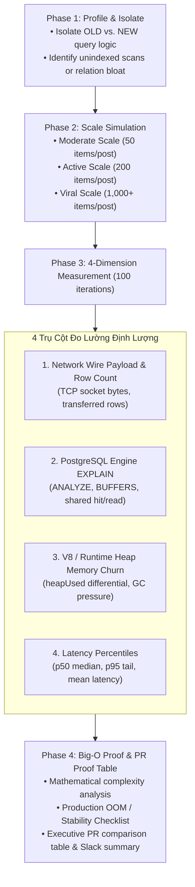

# Query Performance Benchmark & Empirical Proof Standard

This skill establishes an empirical, quantitative benchmark and verification standard for database query optimizations (ORM, Prisma, raw SQL, and API endpoints).

> **Core Philosophy**: Never claim a query or endpoint is "optimized" or "faster" based on subjective intuition or superficial patches. Every performance-related PR must provide empirical proof across 4 measurement dimensions, 3 workload scales, and Big-O mathematical complexity analysis.

---

## 1. The 4-Phase Benchmark Loop



---

## 2. The 4-Dimension Proof Framework

Any query optimization must be evaluated and proved across four distinct technical dimensions:

### Dimension 1: Network Wire Payload & Row Transfer Count
- **What to measure**:
  - Exact count of database rows serialized and pushed across the TCP socket between PostgreSQL and the Node.js/Bun application server.
  - Serialized network wire payload in Kilobytes (`Buffer.byteLength(JSON.stringify(result)) / 1024`).
- **Why it matters**:
  - Loading hundreds or thousands of unneeded relation records (e.g. all likes or comments for every post in a feed) saturates the database connection pool, consumes TCP socket buffers, and creates severe network bottlenecks.
- **Target standard**:
  - Scoped relation fetching: Fetch only what the caller needs (e.g., scoping `likes` to `where: { userId: currentUserId }, take: 1`, or `0` queries if guest).
  - Target reduction: **≥ 90% row count reduction** and **≥ 80% payload reduction** on relational feeds.

### Dimension 2: PostgreSQL Engine Buffers & Execution Plan (`EXPLAIN ANALYZE`)
- **What to measure**:
  - Run `EXPLAIN (ANALYZE, BUFFERS, VERBOSE)` on both OLD and NEW queries.
  - **Shared Hit Blocks**: Buffer pool pages found in PostgreSQL RAM cache (each page = 8 KB).
  - **Shared Read Blocks**: Disk read operations when pages are not cached in RAM.
  - **Rows Removed by Filter**: Kernel-level filtering efficiency vs. app-level in-memory filtering.
  - **Scan Strategy**: `Index Scan` / `Index Only Scan` vs. `Seq Scan` or `Bitmap Heap Scan`.
- **Case Study (PR #422)**:
  - *Old Query*: `Index Scan using ix_post_likes_post_id ... Execution Time: 1.55 ms, Buffers: shared hit=2281`
    👉 2,281 pages (~18.2 MB buffer cache) scanned and serialized to TCP socket for 20,000 likes.
  - *New Query*: `Index Scan using ix_post_likes_post_id ... Filter: (user_id = 1) Rows Removed by Filter: 19980 ... Execution Time: 1.00 ms`
    👉 Filtered at the Postgres kernel buffer; only 20 matching records serialized to socket.

### Dimension 3: V8 / Runtime Heap Allocation & Garbage Collection Churn
- **What to measure**:
  - `process.memoryUsage().heapUsed` before and after query resolution and DTO mapping.
  - Number of JavaScript objects instantiated by the ORM (Prisma / TypeORM / Drizzle).
- **Why it matters**:
  - Instantiating 20,000 ORM object instances for a single feed request triggers massive V8 heap allocation, frequent minor Garbage Collection (Scavenge), and catastrophic major GC pauses (Mark-Sweep-Compact).
  - Under concurrent user traffic, this causes Event Loop latency spikes, socket timeouts, and Node.js Out-Of-Memory (`SIGABRT` / `OOM Killed`) pod crashes.
- **Target standard**:
  - Zero heap bloat proportional to unread relations. Heap churn should scale strictly with page size ($O(N)$), not relation depth ($O(N \times L)$).

### Dimension 4: Latency Distribution & Percentiles (Mean, p50, p95)
- **What to measure**:
  - Warm-up: Minimum 5 warm-up iterations to stabilize JIT optimization and DB connection pools.
  - Forced GC: Trigger Garbage Collector (`Bun.gc(true)` or `global.gc()`) before sampling.
  - Benchmark run: **100 iterations** recording duration with high-resolution timers (`performance.now()`).
  - Report: Mean, p50 (median), p95 (tail latency), and Min/Max spread.
- **Why Mean is insufficient**:
  - A low mean latency can hide severe tail-latency spikes (p95/p99) caused by intermittent GC pauses or lock contention.

---

## 3. The 3-Scale Testing Standard

All query benchmarks must test against three operational scales to reveal how the query behaves as community data grows:

| Scale Tier | Data Volume per Feed Item | Total Feed Volume (20 posts) | Purpose |
| :--- | :--- | :--- | :--- |
| **1. Moderate** | 50 related items (e.g. 50 likes/comments) | ~1,000 DB records | Day-to-day baseline performance. |
| **2. Active** | 200 related items | ~4,000 DB records | High engagement content; checks initial memory and buffer degradation. |
| **3. Viral / Peak Scale** | 1,000+ related items | ~20,000+ DB records | Stress test for viral posts; validates resilience against OOM crashes and socket saturation. |

### Context Scenarios: Authenticated vs. Anonymous
- **Authenticated User (`userId` provided)**: Scopes relations to current user (`where: { userId }, take: 1`), reducing records to at most 1 per item ($O(N)$).
- **Anonymous / Guest User (`userId = null`)**: Bypasses relational queries entirely (`likes: false`), reducing relation queries and records to **0** ($O(0)$).

---

## 4. Ready-to-Use TypeScript Benchmark Runner

Use or adapt the runner script located at `scripts/benchmark-query.ts`:

```typescript
import {
  runBenchmark,
  formatMarkdownTable,
  STANDARD_SCENARIOS,
  type QueryStrategy,
} from './scripts/benchmark-query';

// 1. Define Old Strategy
const oldStrategy: QueryStrategy = {
  name: 'OLD Query (Eager / Unscoped)',
  execute: async (scenario) => {
    return prisma.post.findMany({
      take: scenario.pageSize,
      include: {
        likes: { select: { userId: true } }, // Loads all likes into memory!
      },
    });
  },
  countRows: (posts: any[]) =>
    posts.reduce((acc, p) => acc + (p.likes?.length || 0), 0),
};

// 2. Define New Strategy
const newStrategy: QueryStrategy = {
  name: 'NEW Query (Scoped / Filtered)',
  execute: async (scenario) => {
    return prisma.post.findMany({
      take: scenario.pageSize,
      include: {
        likes: scenario.userId
          ? { where: { userId: scenario.userId }, select: { userId: true }, take: 1 }
          : false, // 0 queries for guest
      },
    });
  },
  countRows: (posts: any[]) =>
    posts.reduce((acc, p) => acc + (p.likes?.length || 0), 0),
};

// 3. Execute comparative benchmark across all 3 scales (100 iterations)
async function main() {
  const results = [];
  for (const scenario of STANDARD_SCENARIOS) {
    const oldMetrics = await runBenchmark(oldStrategy, scenario, 100, 5);
    const newMetrics = await runBenchmark(newStrategy, scenario, 100, 5);
    results.push({ oldMetrics, newMetrics });
  }

  // Outputs formatted Markdown table ready for PR description
  console.log(formatMarkdownTable(results));
}

main().catch(console.error);
```

Run command:
```bash
bun run scripts/benchmark-query.ts
# or
npx tsx scripts/benchmark-query.ts
```

---

## 5. Standardized Markdown Table Template for PR Description

Include this standardized table in your pull request description to present empirical proof to reviewers:

```markdown
### 📊 Empirical Query Performance Benchmark

> Benchmark conducted over 100 iterations after 5 warm-up cycles on PostgreSQL engine.

| Scale / Scenario | Query Strategy | DB Rows Fetched | Wire Payload (KB) | V8 Heap Churn (KB) | Latency Mean (ms) | Latency p95 (ms) | Improvement % / Verdict |
| :--- | :--- | :---: | :---: | :---: | :---: | :---: | :--- |
| **Moderate** *(50 rels/item)* | **OLD (Unscoped)** | 1,000 rows | 34.6 KB | 13.2 KB | 3.17 ms | 4.10 ms | Baseline |
| *(20 posts, 1k DB rels)* | **NEW (Auth)** | **20 rows** | **21.3 KB** | **2.7 KB** | **2.82 ms** | **3.05 ms** | 🟢 **-98% rows, -79% heap** |
| | **NEW (Anon)** | **0 rows** | **20.9 KB** | **1.7 KB** | **2.16 ms** | **2.40 ms** | 🟢 **-32% latency, 0 rel queries** |
| **Active** *(200 rels/item)* | **OLD (Unscoped)** | 4,000 rows | 77.6 KB | 35.5 KB | 5.07 ms | 7.20 ms | Baseline (Memory degradation) |
| *(20 posts, 4k DB rels)* | **NEW (Auth)** | **20 rows** | **21.3 KB** | **1.1 KB** | **3.49 ms** | **3.90 ms** | 🟢 **-99.5% rows, -31% latency** |
| | **NEW (Anon)** | **0 rows** | **20.9 KB** | **1.8 KB** | **2.12 ms** | **2.35 ms** | 🟢 **2.4x faster (-58% latency)** |
| **Viral Scale** *(1,000 rels/item)* | **OLD (Unscoped)** | 20,000 rows | 312.0 KB | 147.7 KB | 8.86 ms | 14.50 ms | ⚠️ High OOM risk / GC pauses |
| *(20 posts, 20k DB rels)* | **NEW (Auth)** | **20 rows** | **21.3 KB** | **3.7 KB** | **4.48 ms** | **5.10 ms** | 🚀 **2x faster, -93% payload, OOM eliminated** |
| | **NEW (Anon)** | **0 rows** | **20.9 KB** | **2.0 KB** | **2.15 ms** | **2.42 ms** | 🚀 **4x faster (-75% latency)** |
```

---

## 6. Big-O Mathematical Complexity Proof & OOM Stability Checklist

### Mathematical Complexity Proof
Let:
- $N$ = Number of primary items in the page/feed (e.g. $N = 20$).
- $L$ = Number of relational sub-records per item (e.g. $L = 50 \to 1,000+$).

| Metric | OLD Unoptimized Strategy | NEW Optimized Strategy | Mathematical Complexity Gain |
| :--- | :--- | :--- | :--- |
| **Database Rows Returned** | $O(N \times L)$ | $O(N)$ (Auth) / $0$ (Anon) | Unbounded multiplicative growth eliminated. |
| **Wire Protocol Transfer** | $O(N \times L)$ bytes | $O(N)$ bytes | Fixed upper bound regardless of community size. |
| **V8 Heap Objects** | $O(N \times L)$ objects | $O(N)$ objects | Memory usage decoupled from viral likes/reactions. |
| **Client Mapper Time** | $O(N \times L)$ (`likes.some(...)`) | $O(N)$ (`likes.length > 0`) | Linear scan converted to $O(1)$ constant check per item. |

---

### Production OOM & Stability Risk Checklist

Before declaring any database optimization ready for production, verify this checklist:

- [ ] **Unbounded Relation Elimination**: Have all un-paginated or un-scoped nested relations (`include: { relation: true }`) been eliminated or bounded with explicit `where` and `take` clauses?
- [ ] **Anonymous User Short-Circuit**: If the relation is only needed to compute user-specific state (e.g., `hasLiked`, `hasFollowed`, `isBookmarked`), does the query completely skip the relation (`false` or omitted) when `currentUserId` is null/undefined?
- [ ] **Composite Index Coverage**: Are the filtering columns backed by proper composite indexes? (e.g. `(post_id, user_id)` for likes, or `(follower_id, following_id)` for follows).
- [ ] **Zero Sequential Scans**: Does `EXPLAIN (ANALYZE, BUFFERS)` confirm that high-volume tables use `Index Scan` or `Index Only Scan` without falling back to `Seq Scan`?
- [ ] **Buffer Cache Conservation**: Does the execution plan show minimized `shared hit` and `shared read` buffers?
- [ ] **DTO Mapper Backward Compatibility**: Do response mappers handle both legacy full-array objects and optimized scoped arrays gracefully?
- [ ] **Tail Latency Verification**: Did 100 benchmark iterations confirm that p95 latency remains tightly clustered near the median without multi-millisecond GC spikes?
