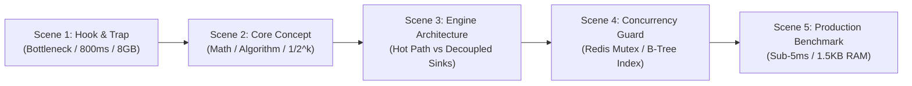

# Skill: Tech Reel Factory (Remotion + Craft Minimalism)

## Purpose
Automate the end-to-end production of production-grade 1080x1920 (9:16) 60FPS vertical Tech Explainer Reels for Facebook Reels, TikTok, and YouTube Shorts. Any agent or subagent equipped with this skill can take a technical topic or battle drill and produce a published MP4 video with studio-quality Vietnamese voiceover and pixel-perfect Dark UI matching `khanhdp.com`.

---

## 🧭 Invariant Design System: Paco Coursey / Craft Minimalism (`khanhdp.com`)

Every video generated by this skill MUST strictly adhere to these design tokens:
- **Canvas Background:** `#0a0a0a` (`bg-[#0a0a0a]`) with subtle radial hairline dot grid.
- **Card Containers:** `#111111` (`bg-[#111111]`) with hairline borders (`border border-white/[0.08]`).
- **Brand Status Indicator:** Pulsing emerald LED (`bg-emerald-500 ring-4 ring-emerald-500/20 animate-pulse`).
- **Telemetry Waveform:** 32-bar audio telemetry waveform reactive to playback frames.
- **Typography:**
  - `Inter`: Titles, hooks, captions, body text.
  - `JetBrains Mono`: Code blocks, bitstreams, benchmarks, frame timecodes, hashes.
- **Accent Accents:**
  - `#10b981` (Emerald): Hits, sub-5ms latency, verified status.
  - `#f59e0b` (Amber): Scanning cursors, warnings, mutex locks.
  - `#f43f5e` (Rose): Un-cached joins, stampede bottlenecks, RAM explosions.

---

## 🎬 The 5-Scene Blueprint Standard

Every video must strictly follow this 5-scene structure (optimal for 40-60 second mobile retention):



1. **Scene 1 (Hook & Trap):** High-stakes failure, query choke, or memory explosion.
2. **Scene 2 (Core Principle):** Theoretical mechanism or mathematical foundation.
3. **Scene 3 (Engine Deep Dive):** Architecture flow (e.g. FastAPI + Redis in-memory vs Postgres).
4. **Scene 4 (Concurrency Guard):** Distributed lock, stampede protection, or index optimization.
5. **Scene 5 (Production Benchmark):** Concrete before/after metric, conclusion, and call to action.

---

## 🚀 Autonomous Execution Modes

### Mode A: Fully Automated One-Line Generation
When given a slug and topic or existing `scenes.json`, run the factory automation script:
```bash
# Example 1: From raw topic (Scaffolds kịch bản, sinh audio, dựng visualizer và render)
python3 scripts/auto_produce_reel.py \
  --slug ep5-consistent-hashing \
  --title "Consistent Hashing" \
  --topic "Cách Distributed Caching chia tải mà không băm lại toàn bộ keys"

# Example 2: From custom scenes.json
python3 scripts/auto_produce_reel.py \
  --slug ep5-consistent-hashing \
  --from-json path/to/scenes.json
```

### Mode B: Sub-Agent Manual Step-by-Step Production

When executing custom visual animations, follow these 5 deterministic steps:

#### Step 1: Create Isolated Episode Directory
```bash
mkdir -p src/episodes/<ep-slug> public/audio/<ep-slug>
```

#### Step 2: Write `scenes.json` Spec
Define 5 scenes with natural Vietnamese studio voiceover text:
```json
[
  {
    "id": 1,
    "phase": "Hook & Trap",
    "title": "Cạm Bẫy Hiệu Năng",
    "hook": "Tại sao giải pháp truyền thống khiến Database quá tải?",
    "concept": "DATABASE BOTTLENECK",
    "keyPoints": ["Latencies > 800ms", "Pool connection exhaustion"],
    "voiceover": "Khi hàng nghìn request cùng ùa vào, truy vấn đệ quy sẽ khiến database sập ngay lập tức!"
  }
]
```

#### Step 3: Generate Studio Voiceover (Edge Neural TTS)
```bash
edge-tts --voice vi-VN-NamMinhNeural --rate="+5%" --text "..." --write-media "public/audio/<ep-slug>/scene1.mp3"
afconvert -f WAVE -d LEI16@24000 "public/audio/<ep-slug>/scene1.mp3" "public/audio/<ep-slug>/scene1.wav"
```

#### Step 4: Extract Frame-Accurate Timings
Run the built-in timing calculator:
```bash
python3 scripts/sync_audio_durations.py public/audio/<ep-slug>/
```
Copy the resulting `AUDIO_DURATIONS` array directly into `src/episodes/<ep-slug>/constants.ts`.

#### Step 5: Render Verification Stills & Master MP4
```bash
# 1. Stills Verification Gate
bunx remotion still src/episodes/<ep-slug>/index.tsx <ReelID> out/<ep-slug>_still.png --frame=200

# 2. Production Video Render (1080x1920 @ 60FPS)
bunx remotion render src/episodes/<ep-slug>/index.tsx <ReelID> out/<ep-slug>.mp4 --concurrency=4
```

---

## 📋 Quality & Verification Checklist Before Handover
- [ ] Frame rate is strictly `60 FPS` and resolution is `1080x1920` (9:16 vertical).
- [ ] Design strictly matches Paco Coursey minimalism (`#0a0a0a`, `#111111`, hairline `border-white/[0.08]`).
- [ ] Audio voiceover is clear 24kHz/48kHz stereo, synchronized with segmented timeline.
- [ ] Rendered MP4 exists on disk in `out/<slug>.mp4` and has been probed with `remotion ffprobe`.
- [ ] `bun test` passes 100% without typecheck or linter errors.
